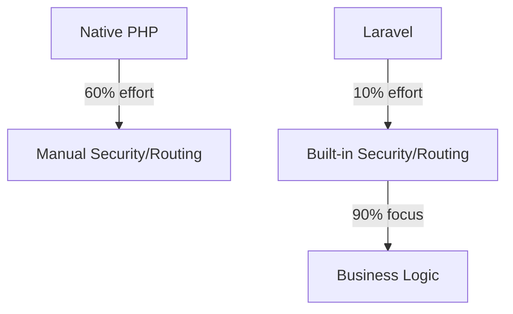

# 1.2 Why Laravel? (ทำไมต้อง Laravel?)

> 📖 **บทนี้คุณจะได้เรียนรู้**
> - จุดเด่นของ Laravel Framework
> - Ecosystem ที่แข็งแกร่ง
> - การเปรียบเทียบกับ Framework อื่นๆ

---

## 🎯 วัตถุประสงค์
เพื่อให้เข้าใจเหตุผลที่องค์กรระดับโลกเลือกใช้ Laravel และความได้เปรียบในการพัฒนาซอฟต์แวร์ที่รวดเร็วและปลอดภัย

## 📚 เนื้อหา

### 1. The PHP Renaissance
Laravel ไม่ใช่แค่เครื่องมือเขียนเว็บ แต่เป็นส่วนสำคัญที่ทำให้ภาษา PHP กลับมายิ่งใหญ่ ด้วยการนำ Design Patterns ที่ดีมาใช้ (เช่น Dependency Injection, MVC, Facades)

### 2. Ecosystem ที่ครบวงจร
- **Eloquent ORM**: จัดการฐานข้อมูลเหมือนเขียนภาษาโปรแกรมปกติ
- **Blade Engine**: ระบบ Template ที่สวยงามและทรงพลัง
- **Artisan CLI**: เครื่องมือสั่งงานผ่าน Command Line ที่ช่วยลดงาน Manual

#### 💡 ตัวอย่างความง่ายของ Eloquent vs Standard SQL

```php
// Standard SQL (ยากและเสี่ยง)
// SELECT * FROM users WHERE active = 1;

// Eloquent (ง่ายและอ่านออก)
$activeUsers = User::where('active', 1)->get();
```

#### 📊 เปรียบเทียบ Development Speed



### 🤖 การใช้ AI วิเคราะห์ความเหมาะสม

#### Prompt ตัวอย่าง:
"Compare Laravel with Express.js for a government database project that requires high security and complex reporting."

---

## 🎓 แบบฝึกหัด
**โจทย์:** ลองหาชื่อบริษัทหรือโปรเจกต์ดังๆ ในไทยที่ใช้ Laravel
**เฉลย:** เช่น Wongnai (บางส่วน), ระบบจองคิวต่างๆ, และ Startups จำนวนมาก

---

**Navigation:**
[⬅️ ก่อนหน้า](01-course-overview.md) | [📚 สารบัญ](../../README.md) | [➡️ ถัดไป](03-ai-in-development.md)
