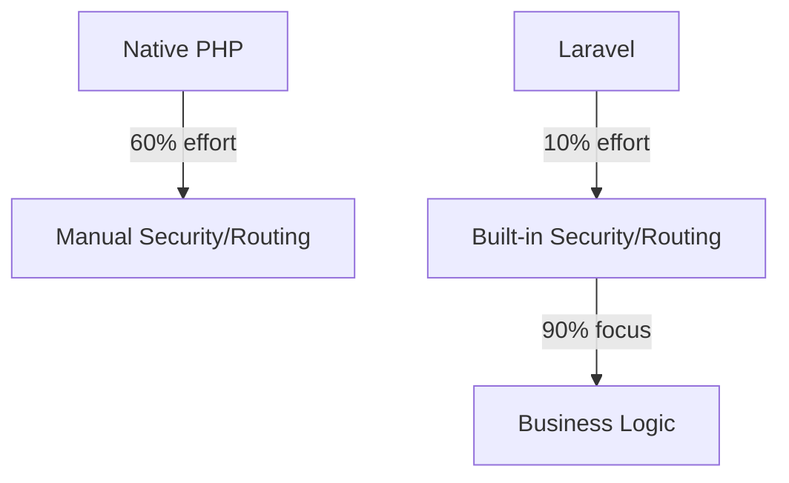

# 1.2 Why Laravel? (ทำไมต้อง Laravel?)

> **บทนี้คุณจะได้เรียนรู้**
> - จุดเด่นของ Laravel Framework
> - Ecosystem ที่แข็งแกร่ง
> - การเปรียบเทียบกับ Framework อื่นๆ
> - การใช้ AI วิเคราะห์ความเหมาะสม

---

## วัตถุประสงค์การเรียนรู้

เมื่อจบบทเรียนนี้ ผู้เรียนจะสามารถ:
1. อธิบายจุดเด่นของ Laravel Framework ได้
2. เข้าใจ Ecosystem ของ Laravel และประโยชน์ที่ได้รับ
3. เปรียบเทียบ Laravel กับ Framework อื่นๆ ได้อย่างมีหลักการ
4. ใช้ AI ช่วยวิเคราะห์ความเหมาะสมในการเลือก Framework

---

## เนื้อหา

### 1. The PHP Renaissance

Laravel ไม่ใช่แค่เครื่องมือเขียนเว็บ แต่เป็นส่วนสำคัญที่ทำให้ภาษา PHP กลับมายิ่งใหญ่ ด้วยการนำ Design Patterns ที่ดีมาใช้ (เช่น Dependency Injection, MVC, Facades)

#### เหตุผลที่ Laravel ทำให้ PHP กลับมาได้รับความนิยม

| ปัญหาของ PHP ดั้งเดิม | วิธีที่ Laravel แก้ไข |
|---------------------|--------------------|
| โค้ดรุงรัง ไม่มีโครงสร้าง | สถาปัตยกรรม MVC ที่ชัดเจน |
| ความปลอดภัยต่ำ | ระบบป้องกัน CSRF, XSS, SQL Injection |
| การพัฒนาช้า | Artisan CLI, Generator ต่างๆ |
| ทดสอบยาก | Testing Framework ในตัว |

### 2. Ecosystem ที่ครบวงจร

#### 2.1 องค์ประกอบหลักของ Laravel

| คุณสมบัติ | รายละเอียด | ประโยชน์ |
|---------|----------|--------|
| **Eloquent ORM** | จัดการฐานข้อมูลแบบ Object-Oriented | ลดความซับซ้อนของ SQL, ป้องกัน SQL Injection |
| **Blade Engine** | ระบบ Template ที่มีประสิทธิภาพ | แยก Logic ออกจาก View, สร้าง Component ได้ |
| **Artisan CLI** | เครื่องมือสั่งงานผ่าน Command Line | สร้าง Boilerplate Code, Migration, Seeding |
| **Middleware** | ตัวกรองคำขอ HTTP | จัดการ Authentication, Logging, CORS |
| **Queue** | ระบบคิวงาน | ประมวลผลงานหนักแบบ Asynchronous |

#### 2.2 ตัวอย่างความง่ายของ Eloquent vs Standard SQL

```php
// Standard SQL (ยากและเสี่ยง)
// SELECT * FROM users WHERE active = 1;

// Eloquent (ง่ายและอ่านออก)
$activeUsers = User::where('active', 1)->get();
```

#### 2.3 เปรียบเทียบ Development Speed



### 3. การเปรียบเทียบกับ Framework อื่นๆ

| Framework | จุดแข็ง | จุดอ่อน | เหมาะกับ |
|----------|-------|-------|--------|
| **Laravel** | Full-stack, Ecosystem สมบูรณ์ | ใช้ทรัพยากรมาก | โปรเจกต์ขนาดกลาง-ใหญ่ |
| **Symfony** | Component-based, Enterprise | เรียนรู้ยาก | Enterprise Applications |
| **CodeIgniter** | เบา เร็ว | Feature น้อยกว่า | โปรเจกต์ขนาดเล็ก |
| **Express.js** | Non-blocking I/O | ต้องเขียน JS | API, Microservices |

### 4. การใช้ AI วิเคราะห์ความเหมาะสม

#### Prompt ตัวอย่าง:

```
Compare Laravel with Express.js for a government database project that requires high security and complex reporting.
```

#### ตัวอย่างการวิเคราะห์:

```
สำหรับโปรเจกต์ฐานข้อมูลของรัฐบาลที่ต้องการความปลอดภัยสูงและรายงานที่ซับซ้อน:

1. Laravel มีข้อได้เปรียบด้าน:
   - ระบบ Authentication และ Authorization ในตัว
   - ORM ที่ช่วยป้องกัน SQL Injection
   - ระบบ Form Validation ที่แข็งแกร่ง
   - การสร้างรายงานที่ซับซ้อนทำได้ง่ายกว่า

2. Express.js อาจไม่เหมาะสมเพราะ:
   - ต้องติดตั้ง Libraries เพิ่มเติมหลายตัว
   - การจัดการ Authentication ต้องทำเอง
   - การสร้างรายงานที่ซับซ้อนทำได้ยากกว่า
```

---

## แบบฝึกหัด

### Exercise 1: วิเคราะห์ความเหมาะสม

**โจทย์:** ลองหาชื่อบริษัทหรือโปรเจกต์ดังๆ ในไทยที่ใช้ Laravel พร้อมอธิบายเหตุผลที่เลือกใช้

<details>
<summary>ดูเฉลย</summary>

**เฉลย:** 
- **Wongnai** (บางส่วน): ใช้ Laravel เพราะต้องการระบบที่พัฒนาได้เร็วและมี Ecosystem ที่สมบูรณ์
- **ระบบจองคิวต่างๆ**: ใช้ Laravel เพราะมีระบบ Authentication และ Queue ในตัว
- **Startups จำนวนมาก**: ใช้ Laravel เพราะพัฒนาได้เร็ว ลดต้นทุนและเวลา Time-to-Market

</details>

---

## สรุป

| หัวข้อ | สิ่งที่ได้เรียนรู้ |
|--------|-------------------|
| The PHP Renaissance | Laravel ช่วยยกระดับ PHP ด้วย Design Patterns ที่ดี |
| Ecosystem | Eloquent ORM, Blade, Artisan CLI ช่วยเพิ่มประสิทธิภาพ |
| เปรียบเทียบกับ Framework อื่น | Laravel เหมาะกับโปรเจกต์ขนาดกลาง-ใหญ่ |
| AI Analysis | ใช้ AI ช่วยเลือก Framework ที่เหมาะสมกับโปรเจกต์ |

---

**Navigation:**
[⬅️ ก่อนหน้า](01-course-overview.md) | [📚 สารบัญ](../../README.md) | [➡️ ถัดไป](03-ai-in-development.md)
