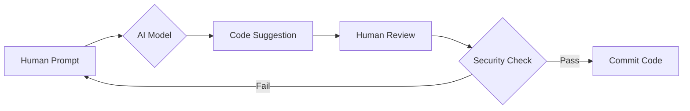

# 1.3 AI in Modern Development (AI ในการพัฒนาซอฟต์แวร์ยุคใหม่)

> **บทนี้คุณจะได้เรียนรู้**
> - บทบาทของ AI ในการเขียนโปรแกรมยุคปัจจุบัน
> - เครื่องมือ AI ที่นักพัฒนาโปรแกรมมืออาชีพเลือกใช้
> - ความแตกต่างระหว่างการเขียนเองกับการใช้ AI ช่วยเขียน
> - Prompt Engineering สำหรับ Laravel
> - ข้อควรระวังในการใช้ AI

---

## วัตถุประสงค์การเรียนรู้

เมื่อจบบทเรียนนี้ ผู้เรียนจะสามารถ:
1. อธิบายบทบาทของ AI ในการพัฒนาซอฟต์แวร์ยุคปัจจุบันได้
2. เลือกใช้เครื่องมือ AI ที่เหมาะสมกับงานพัฒนา Laravel ได้
3. เขียน Prompt ที่มีประสิทธิภาพสำหรับการพัฒนา Laravel ได้
4. ระบุข้อควรระวังในการใช้ AI ช่วยเขียนโค้ดได้อย่างถูกต้อง

---

## เนื้อหา

### 1. วิวัฒนาการของการพัฒนาด้วย AI

สมัยก่อนเราต้องเปิด Stack Overflow เพื่อหาคำตอบ แต่ปัจจุบัน AI สามารถช่วยเราได้ใน IDE โดยตรง เปรียบเสมือน **"โปรแกรมเมอร์คู่หู"** ที่คอยช่วยเหลือตลอดเวลา

| ความสามารถของ AI | รายละเอียด | ตัวอย่างการใช้งาน |
|-----------------|-----------|-----------------|
| **Code Autocompletion** | เดาว่าเราจะพิมพ์อะไรต่อ | พิมพ์ `$user->` แล้ว AI แนะนำ method |
| **Logic Explanation** | อธิบายโค้ดที่เราไม่เข้าใจ | วาง Middleware แล้วถาม AI ว่าทำงานอย่างไร |
| **Unit Test Generation** | สร้างชุดทดสอบให้อัตโนมัติ | สร้าง Test สำหรับ Controller method |
| **Code Refactoring** | ปรับปรุงโค้ดให้ดีขึ้น | แนะนำ Design Pattern ที่เหมาะสม |

#### ตัวอย่างการใช้ AI ช่วย Generate Migration

```php
// ตัวอย่าง Prompt:
// "สร้าง Laravel migration สำหรับตาราง complaints
//  โดยมีคอลัมน์ title, description, status (enum), และ user_id (foreign key)"
```

#### Flow: AI Workflow สู่ความปลอดภัย



#### ข้อควรระวังในการใช้ AI

| ข้อควรระวัง | รายละเอียด | วิธีป้องกัน |
|------------|-----------|------------|
| **Hallucinations** | AI อาจมโนฟังก์ชันที่ไม่มีจริงขึ้นมา | ตรวจสอบกับ Official Documentation เสมอ |
| **Security Risks** | โค้ดที่ AI สร้างอาจมีช่องโหว่ | Review โค้ดทุกครั้งก่อน Commit |
| **Privacy** | อย่าใส่ข้อมูลความลับขององค์กร | ใช้ข้อมูลจำลองแทนข้อมูลจริง |
| **Outdated Knowledge** | AI อาจแนะนำวิธีเก่าที่ Deprecated | ตรวจสอบเวอร์ชันของ Library ที่ใช้ |

---

### 2. Prompt Engineering สำหรับ Laravel

การเขียน Prompt ที่ดีจะช่วยให้ AI สร้างโค้ดที่มีคุณภาพมากขึ้น เปรียบเสมือน **"การสั่งงานที่ชัดเจน"** ยิ่งบอกรายละเอียดมาก ผลลัพธ์ยิ่งตรงใจ

#### Prompt ตัวอย่าง:

```
สร้าง Laravel Resource Controller ชื่อ TaskController
- มี CRUD ครบ 7 methods
- ใช้ Route Model Binding
- มี Validation สำหรับ title (required, max 255) และ due_date (required, date, after:today)
- มี Flash Message ภาษาไทย
```

#### ผลลัพธ์:

```php
public function store(Request $request)
{
    $validated = $request->validate([
        'title' => 'required|max:255',
        'due_date' => 'required|date|after:today',
    ]);

    $task = Task::create($validated);

    return redirect()
        ->route('tasks.show', $task)
        ->with('success', 'เพิ่มงานเรียบร้อยแล้ว');
}
```

#### การ Review Code จาก AI

เมื่อได้โค้ดจาก AI ให้ตรวจสอบ:
- [ ] ฟังก์ชันและ Class ที่ใช้มีอยู่จริงใน Laravel เวอร์ชันปัจจุบันหรือไม่
- [ ] Validation rules ครบถ้วนและเหมาะสมหรือไม่
- [ ] มีช่องโหว่ด้านความปลอดภัยหรือไม่
- [ ] โค้ดอ่านง่ายและเป็นไปตาม Convention หรือไม่

---

## สรุป

| หัวข้อ | สิ่งที่ได้เรียนรู้ |
|--------|-------------------|
| วิวัฒนาการ AI | AI ช่วยเพิ่ม Developer Velocity ให้โฟกัสที่ Business Logic |
| ความสามารถ AI | Autocompletion, Explanation, Test Generation, Refactoring |
| ข้อควรระวัง | Hallucinations, Security Risks, Privacy, Outdated Knowledge |
| Prompt Engineering | เขียน Prompt ที่ชัดเจนจะได้ผลลัพธ์ที่ดีกว่า |

---

**Navigation:**
[⬅️ ก่อนหน้า](02-why-laravel.md) | [📚 สารบัญ](../../README.md) | [➡️ ถัดไป](04-environment-setup.md)
