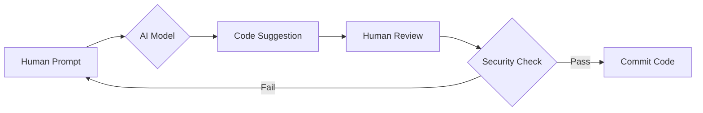

# 1.3 AI in Modern Development

> 📖 **บทนี้คุณจะได้เรียนรู้**
> - บทบาทของ AI ในการเขียนโปรแกรมยุคปัจจุบัน
> - เครื่องมือ AI ที่นักพัฒนาโปรแกรมมืออาชีพเลือกใช้
> - ความแตกต่างระหว่างการเขียนเองกับการใช้ AI ช่วยเขียน

---

## 🎯 วัตถุประสงค์

เพื่อให้เข้าใจว่า AI ไม่ใช่เครื่องมือที่ทำให้โปรแกรมเมอร์ "ขี้เกียจ" แต่เป็นเครื่องมือ "เพิ่มประสิทธิภาพ" (Developer Velocity) ที่ช่วยให้เราโฟกัสไปที่ตรรกะทางธุรกิจ (Business Logic) มากกว่าการพิมพ์ซ้ำซ้อน

## 📚 เนื้อหา

### วิวัฒนาการของการพัฒนาด้วย AI

สมัยก่อนเราต้องเปิด Stack Overflow เพื่อหาคำตอบ แต่ปัจจุบัน AI สามารถช่วยเราได้ใน IDE โดยตรง:
- **Code Autocompletion**: เดาว่าเราจะพิมพ์อะไรต่อ
- **Logic Explanation**: อธิบายโค้ดที่เราไม่เข้าใจ
- **Unit Test Generation**: สร้างชุดทดสอบให้อัตโนมัติ

#### 💡 ตัวอย่างการใช้ AI ช่วย Generate Migration

```php
// ตัวอย่าง Prompt: "สร้าง Laravel migration สำหรับตาราง complaints โดยมีคอมลัมน์ title, description, status (enum), และ user_id (foreign key)"
```

#### 📊 Diagram: AI Workflow สู่ความปลอดภัย



#### ⚠️ ข้อควรระวัง

- **Hallucinations**: AI อาจมโนฟังก์ชันที่ไม่มีจริงขึ้นมา
- **Security Risks**: โค้ดที่ AI สร้างอาจมีช่องโหว่ถ้าเราไม่ตรวจสอบ
- **Privacy**: อย่าใส่ข้อมูลความลับขององค์กรลงใน AI Prompt

---

### 🤖 Prompt Engineering สำหรับ Laravel

#### Prompt ตัวอย่าง:
"Create a Laravel controller for managing tasks with CRUD operations, including validation for title and due_date."

#### ผลลัพธ์:
```php
public function store(Request $request) {
    $validated = $request->validate([
        'title' => 'required|max:255',
        'due_date' => 'required|date|after:today',
    ]);
    
    Task::create($validated);
    return redirect()->route('tasks.index')->with('success', 'Task created!');
}
```

---

**Navigation:**
[⬅️ ก่อนหน้า](02-why-laravel.md) | [📚 สารบัญ](../../README.md) | [➡️ ถัดไป](04-environment-setup.md)
