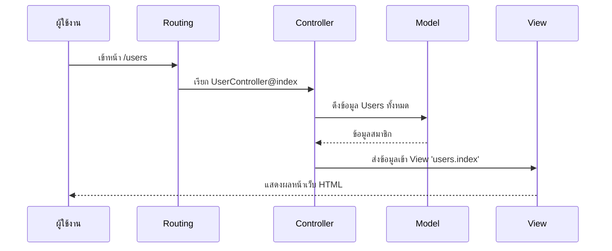

# 2.1 Laravel Architecture (สถาปัตยกรรมของ Laravel)

> 📖 **บทนี้คุณจะได้เรียนรู้**
> - รูปแบบการทำงานแบบ MVC (Model-View-Controller)
> - วงจรชีวิตของ Request (Request Lifecycle)
> - หน้าที่ของ Service Container & Facades

---

## 🎯 วัตถุประสงค์
เพื่อให้เข้าใจ "เส้นทาง" ของข้อมูลตั้งแต่ผู้ใช้งานเริ่มคลิก จนไปถึงการแสดงผลหน้าเว็บ

## 📚 เนื้อหา

### 1. MVC Pattern
Laravel ใช้โครงสร้าง MVC ในการแยกหน้าที่ของโค้ด:
- **Model**: จัดการข้อมูลและการเชื่อมต่อฐานข้อมูล (Eloquent)
- **View**: ส่วนแสดงผลที่ผู้ใช้เห็น (Blade Templates)
- **Controller**: ส่วนควบคุมตรรกะ เชื่อมระหว่าง Model และ View

### 2. Request Lifecycle
ทุกครั้งที่มีการเรียก URL เส้นทางจะเป็นดังนี้:
1. เข้าสู่หน้า `public/index.php`
2. ผ่าน **Middleware** (เช็คความปลอดภัย, Login)
3. ไปที่ **Routing** เพื่อหาว่าต้องไปที่ไหน
4. **Controller** ประมวลผล (เรียกข้อมูลจาก Model)
5. ส่งผลลัพธ์กลับไปที่ **View**

#### 📊 Diagram: Request Flow

---

### 🤖 การใช้ AI ช่วยอธิบาย Concept

#### Prompt ตัวอย่าง:
"Explain Laravel Service Container like I'm 5 years old using a restaurant analogy."

---

## 🎓 แบบฝึกหัด
**โจทย์:** ส่วนไหนของ MVC ที่ทำหน้าที่ติดต่อนักฐานข้อมูล?
**เฉลย:** Model

---

**Navigation:**
[⬅️ ก่อนหน้า](../01-introduction/04-environment-setup.md) | [📚 สารบัญ](../../README.md) | [➡️ ถัดไป](02-project-structure.md)
