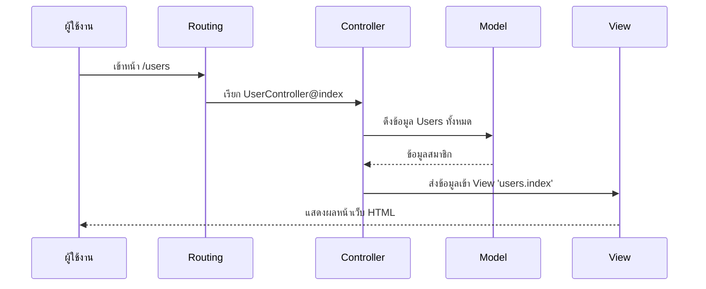

# 2.1 Laravel Architecture (สถาปัตยกรรมของ Laravel)

> **บทนี้คุณจะได้เรียนรู้**
> - รูปแบบการทำงานแบบ MVC (Model-View-Controller)
> - วงจรชีวิตของ Request (Request Lifecycle)
> - หน้าที่ของ Service Container & Facades

---

## วัตถุประสงค์การเรียนรู้

เมื่อจบบทเรียนนี้ ผู้เรียนจะสามารถ:
1. อธิบายรูปแบบ MVC และหน้าที่ของแต่ละส่วนได้
2. อธิบายวงจรชีวิตของ Request ตั้งแต่ต้นจนจบได้
3. เข้าใจบทบาทของ Service Container และ Facades ในระบบ Laravel ได้
4. ใช้ AI ช่วยอธิบาย Concept ที่ซับซ้อนได้

---

## เนื้อหา

### 1. MVC Pattern

**MVC** คือรูปแบบสถาปัตยกรรมที่แยกโค้ดออกเป็น 3 ส่วนหลัก เปรียบเสมือน **"ร้านอาหาร"** ที่แบ่งหน้าที่ชัดเจน

| ส่วนประกอบ | หน้าที่ | เปรียบเทียบกับร้านอาหาร | ตัวอย่างใน Laravel |
|-----------|--------|----------------------|------------------|
| **Model** | จัดการข้อมูลและเชื่อมต่อฐานข้อมูล | พ่อครัว (เตรียมวัตถุดิบ) | Eloquent ORM |
| **View** | ส่วนแสดงผลที่ผู้ใช้เห็น | จานอาหารที่เสิร์ฟ | Blade Templates |
| **Controller** | ส่วนควบคุมตรรกะ เชื่อม Model กับ View | พนักงานเสิร์ฟ (รับออเดอร์ ส่งครัว) | Controller Classes |

#### ทำไมต้องแยกเป็น MVC?

| ปัญหาเมื่อไม่แยก MVC | แก้ไขด้วย MVC |
|---------------------|--------------|
| โค้ดทั้งหมดปนกันในไฟล์เดียว | แยกหน้าที่ชัดเจน แก้ไขง่าย |
| แก้ไขส่วนหนึ่งแล้วพังอีกส่วน | แต่ละส่วนเป็นอิสระต่อกัน |
| ทดสอบยาก | ทดสอบแต่ละส่วนแยกกันได้ |
| ทำงานเป็นทีมลำบาก | แบ่งงานตามส่วนได้ชัดเจน |

### 2. Request Lifecycle

ทุกครั้งที่มีการเรียก URL เส้นทางจะเป็นดังนี้:

| ลำดับ | ขั้นตอน | รายละเอียด |
|------|--------|-----------|
| 1 | `public/index.php` | จุดเริ่มต้นของทุก Request |
| 2 | **Middleware** | เช็คความปลอดภัย, ตรวจสอบ Login |
| 3 | **Routing** | หาว่า URL นี้ต้องไปที่ Controller ไหน |
| 4 | **Controller** | ประมวลผล (เรียกข้อมูลจาก Model) |
| 5 | **View** | สร้าง HTML แล้วส่งกลับไปยังผู้ใช้ |

#### Diagram: Request Flow



### 3. Service Container & Facades

**Service Container** คือหัวใจของ Laravel ทำหน้าที่จัดการ Dependencies ทั้งหมดของแอปพลิเคชัน เปรียบเสมือน **"ผู้จัดการร้านอาหาร"** ที่รู้ว่าต้องเตรียมอะไรบ้างเมื่อมีออเดอร์เข้ามา

| แนวคิด | รายละเอียด | ตัวอย่าง |
|--------|-----------|---------|
| **Service Container** | จัดการการสร้างและ inject dependencies อัตโนมัติ | เมื่อ Controller ต้องการ Service จะถูก inject ให้เอง |
| **Facades** | ทางลัดในการเรียกใช้ Service ต่างๆ | `Auth::user()`, `Cache::get()`, `DB::table()` |
| **Service Provider** | ที่ลงทะเบียน Service เข้า Container | `AppServiceProvider`, `AuthServiceProvider` |

```php
// ตัวอย่าง: ใช้ Facade เรียก Service
use Illuminate\Support\Facades\Cache;

// เก็บข้อมูลลง Cache
Cache::put('key', 'value', 600);

// ดึงข้อมูลจาก Cache
$value = Cache::get('key');
```

---

### การใช้ AI ช่วยอธิบาย Concept

#### Prompt ตัวอย่าง:

```
Explain Laravel Service Container like I'm 5 years old
using a restaurant analogy.
```

#### การ Review คำตอบจาก AI

เมื่อได้คำตอบจาก AI ให้ตรวจสอบ:
- [ ] คำอธิบายตรงกับเวอร์ชัน Laravel ที่ใช้หรือไม่
- [ ] ตัวอย่างโค้ดสามารถรันได้จริงหรือไม่
- [ ] Concept ที่อธิบายถูกต้องตาม Official Documentation หรือไม่

---

## แบบฝึกหัด

### Exercise 1: ทำความเข้าใจ MVC

**โจทย์:** ส่วนไหนของ MVC ที่ทำหน้าที่ติดต่อฐานข้อมูล?

<details>
<summary>ดูเฉลย</summary>

**เฉลย:** **Model** — ทำหน้าที่จัดการข้อมูลและเชื่อมต่อฐานข้อมูลผ่าน Eloquent ORM

**คำอธิบาย:**
- Model เป็นตัวแทนของตารางในฐานข้อมูล
- ใช้ Eloquent ORM ในการ Query ข้อมูลแทนการเขียน SQL โดยตรง
- Controller จะเรียกใช้ Model เพื่อดึงหรือบันทึกข้อมูล

</details>

### Exercise 2: วิเคราะห์ Request Lifecycle

**โจทย์:** เมื่อผู้ใช้เข้าหน้า `/products` ให้อธิบายลำดับการทำงานตั้งแต่ต้นจนจบ

<details>
<summary>ดูเฉลย</summary>

1. Request เข้าสู่ `public/index.php`
2. ผ่าน Middleware (ตรวจสอบ CSRF, Authentication)
3. Routing จับคู่ URL `/products` กับ `ProductController@index`
4. Controller เรียก `Product::all()` ผ่าน Model
5. Model ดึงข้อมูลจากฐานข้อมูล
6. Controller ส่งข้อมูลไปยัง View `products.index`
7. View สร้าง HTML แล้วส่งกลับไปยังผู้ใช้

</details>

---

## สรุป

| หัวข้อ | สิ่งที่ได้เรียนรู้ |
|--------|-------------------|
| MVC Pattern | แยกโค้ดเป็น Model (ข้อมูล), View (แสดงผล), Controller (ควบคุม) |
| Request Lifecycle | index.php → Middleware → Routing → Controller → View |
| Service Container | จัดการ Dependencies อัตโนมัติ เปรียบเสมือนผู้จัดการร้าน |
| Facades | ทางลัดเรียกใช้ Service เช่น `Auth::`, `Cache::`, `DB::` |

---

**Navigation:**
[⬅️ ก่อนหน้า](../01-introduction/04-environment-setup.md) | [📚 สารบัญ](../../README.md) | [➡️ ถัดไป](02-project-structure.md)
