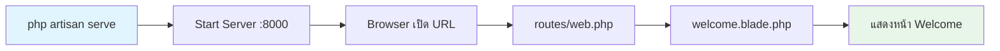

# 2.3 Your First Laravel Project (โปรเจกต์แรกของคุณ)

> **บทนี้คุณจะได้เรียนรู้**
> - การสร้างโปรเจกต์ใหม่ด้วย Laravel Installer
> - การรันเซิร์ฟเวอร์จำลอง
> - การแก้ไขหน้าแรกให้เป็นชื่อของคุณ
> - คำสั่ง Artisan ที่สำคัญ

---

## วัตถุประสงค์การเรียนรู้

เมื่อจบบทเรียนนี้ ผู้เรียนจะสามารถ:
1. สร้างโปรเจกต์ Laravel ใหม่ด้วย Laravel Installer ได้
2. รัน Development Server และเปิดดูผลลัพธ์บน Browser ได้
3. แก้ไขหน้าแรกของ Laravel ให้แสดงข้อความที่ต้องการได้
4. ใช้คำสั่ง Artisan พื้นฐานได้อย่างคล่องแคล่ว

---

## เนื้อหา

### 1. การสร้างโปรเจกต์

```bash
# สร้างโปรเจกต์ Laravel ใหม่
laravel new my-first-app
```

ระหว่างการสร้างโปรเจกต์ Laravel จะถามตัวเลือกต่างๆ:

| คำถาม | ตัวเลือกที่แนะนำ | เหตุผล |
|-------|-----------------|--------|
| Starter kit | No starter kit | เริ่มจากพื้นฐานก่อน |
| Testing framework | Pest หรือ PHPUnit | เลือกตามถนัด |
| Database | MySQL หรือ SQLite | SQLite ง่ายสำหรับเริ่มต้น |
| Run migrations? | Yes | สร้างตารางพื้นฐานให้เลย |

### 2. การรันเซิร์ฟเวอร์

```bash
# เข้าไปในโฟลเดอร์โปรเจกต์
cd my-first-app

# รัน Development Server
php artisan serve
```

จากนั้นเปิด Browser ไปที่ `http://127.0.0.1:8000` จะเห็นหน้า Welcome ของ Laravel

#### Flow: จากคำสั่งสู่หน้าเว็บ



### 3. แก้ไขหน้าแรก

ไปที่ไฟล์ `resources/views/welcome.blade.php` แล้วลองหาคำว่า "Laravel" และเปลี่ยนเป็น "My AI Project"

```php
// resources/views/welcome.blade.php
// หาบรรทัดที่มีคำว่า "Laravel" แล้วเปลี่ยนเป็น:
<h1>My AI Project</h1>
```

### 4. คำสั่ง Artisan ที่สำคัญ

**Artisan** คือเครื่องมือ Command Line ของ Laravel เปรียบเสมือน **"ผู้ช่วยส่วนตัว"** ที่ช่วยสร้างไฟล์และจัดการโปรเจกต์

| คำสั่ง | หน้าที่ | ตัวอย่าง |
|--------|--------|---------|
| `php artisan about` | แสดงข้อมูลสรุปของแอป | ดูเวอร์ชัน, Environment |
| `php artisan list` | แสดงคำสั่งทั้งหมด | ค้นหาคำสั่งที่ต้องการ |
| `php artisan make:controller` | สร้าง Controller | `php artisan make:controller UserController` |
| `php artisan make:model` | สร้าง Model | `php artisan make:model Product -m` |
| `php artisan migrate` | รัน Migration | สร้างตารางในฐานข้อมูล |
| `php artisan serve` | รัน Development Server | เปิดเว็บที่ port 8000 |

```bash
# ลองรันคำสั่งเหล่านี้
php artisan about
php artisan list
php artisan route:list
```

---

### การใช้ AI ช่วยเริ่มต้น

#### Prompt ตัวอย่าง:

```
I want to create a new Laravel project with Tailwind CSS
and a simple login system. What is the best command to use?
```

#### การ Review คำตอบจาก AI

เมื่อได้คำตอบจาก AI ให้ตรวจสอบ:
- [ ] คำสั่งที่แนะนำใช้ได้กับ Laravel เวอร์ชันปัจจุบันหรือไม่
- [ ] ตัวเลือก (flags) ที่แนะนำมีอยู่จริงหรือไม่
- [ ] ลำดับขั้นตอนถูกต้องหรือไม่

---

## แบบฝึกหัด

### Exercise 1: สร้างและรันโปรเจกต์

**โจทย์:** สร้างโปรเจกต์ Laravel ใหม่ รัน Development Server และแก้ไขหน้า `welcome.blade.php` ให้มีข้อความ "Hello [ชื่อของคุณ]"

**เป้าหมาย:**
1. สร้างโปรเจกต์ด้วย `laravel new`
2. รัน `php artisan serve` สำเร็จ
3. แก้ไข `welcome.blade.php` ให้แสดงชื่อของตัวเอง
4. รันคำสั่ง `php artisan about` แล้วอ่านผลลัพธ์

<details>
<summary>ดูเฉลย</summary>

```bash
# ขั้นตอนที่ 1: สร้างโปรเจกต์
laravel new hello-app

# ขั้นตอนที่ 2: เข้าไปในโฟลเดอร์
cd hello-app

# ขั้นตอนที่ 3: รัน Server
php artisan serve
```

จากนั้นแก้ไขไฟล์ `resources/views/welcome.blade.php`:
- หาคำว่า "Laravel" แล้วเปลี่ยนเป็น "Hello สมชาย"
- บันทึกไฟล์แล้ว Refresh Browser จะเห็นข้อความใหม่

**คำอธิบาย:**
- Laravel ใช้ระบบ Hot Reload บางส่วน เมื่อแก้ไข Blade file แล้ว Refresh Browser จะเห็นผลทันที
- คำสั่ง `php artisan about` จะแสดงข้อมูลเช่น Laravel version, PHP version, Environment

</details>

### Exercise 2: สำรวจคำสั่ง Artisan

**โจทย์:** รันคำสั่ง `php artisan list` แล้วหาคำสั่งที่ใช้สร้าง Controller

<details>
<summary>ดูเฉลย</summary>

```bash
# รันคำสั่ง
php artisan list

# จะเห็นรายการคำสั่งทั้งหมด หาในหมวด "make"
# คำตอบคือ: php artisan make:controller
```

</details>

---

## สรุป

| หัวข้อ | สิ่งที่ได้เรียนรู้ |
|--------|-------------------|
| สร้างโปรเจกต์ | ใช้ `laravel new` หรือ `composer create-project` |
| รัน Server | ใช้ `php artisan serve` เปิดที่ port 8000 |
| แก้ไขหน้าแรก | แก้ไขไฟล์ `resources/views/welcome.blade.php` |
| Artisan CLI | เครื่องมือช่วยสร้างไฟล์และจัดการโปรเจกต์ |

---

**Navigation:**
[⬅️ ก่อนหน้า](02-project-structure.md) | [📚 สารบัญ](../../README.md) | [➡️ ถัดไป](../03-routing/01-basic-routing.md)
