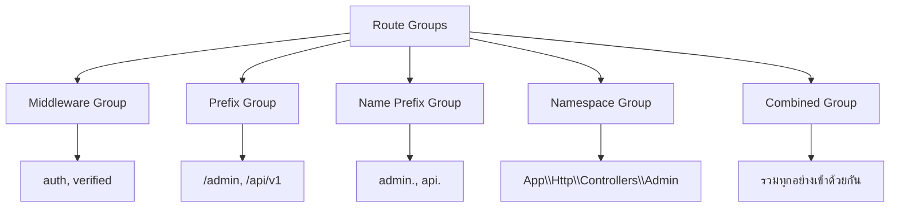
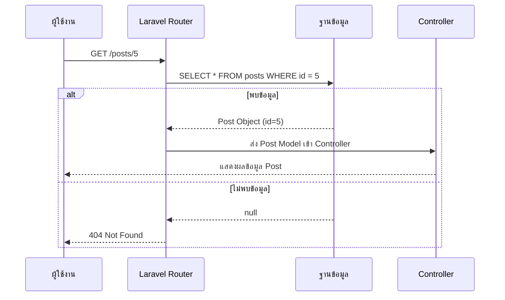
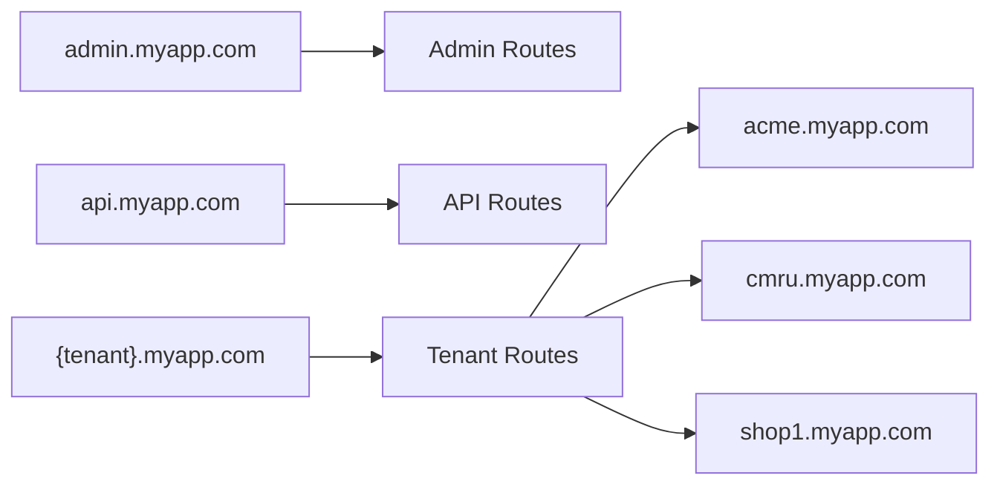
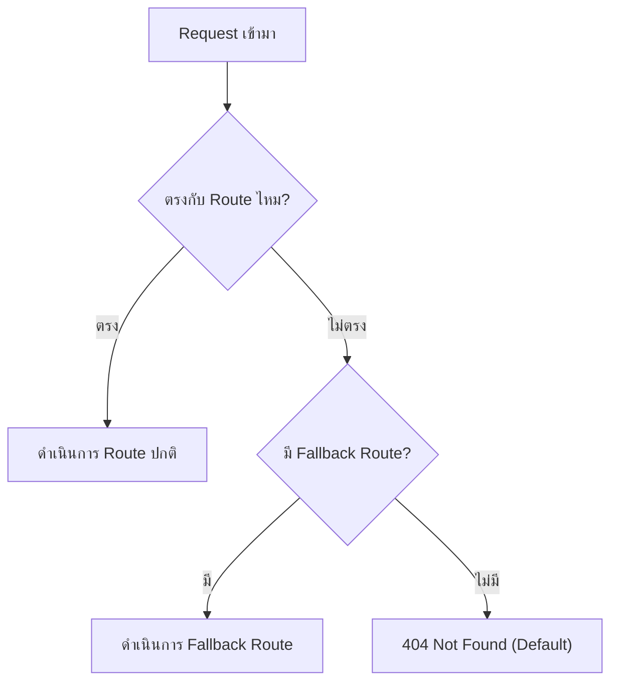

# 3.2 Advanced Routing (เทคนิค Routing ขั้นสูง)

> 📖 **บทนี้คุณจะได้เรียนรู้**
> - Route Groups กับ Middleware, Prefix, Namespace
> - Route Model Binding (Implicit และ Explicit)
> - Route Caching เพื่อเพิ่มประสิทธิภาพ
> - Subdomain Routing
> - Rate Limiting เพื่อป้องกันการเรียกใช้งานมากเกินไป
> - Fallback Routes สำหรับจัดการ URL ที่ไม่มีอยู่
> - การตรวจสอบ Route ปัจจุบัน (Current Route Inspection)

---

## 🎯 วัตถุประสงค์การเรียนรู้

เมื่อจบบทเรียนนี้ ผู้เรียนจะสามารถ:
1. จัดกลุ่ม Route อย่างมีระบบด้วย Route Groups
2. ใช้ Route Model Binding เพื่อดึง Model จาก URL โดยอัตโนมัติ
3. เข้าใจ Route Caching และ Subdomain Routing
4. ตั้งค่า Rate Limiting เพื่อป้องกันระบบ
5. สร้าง Fallback Route เพื่อจัดการหน้า 404 แบบกำหนดเอง

---

## 📚 เนื้อหา

### 1. Route Groups (การจัดกลุ่ม Route แบบละเอียด)

Route Groups ช่วยให้เรากำหนดคุณสมบัติร่วมกัน เช่น Middleware, Prefix, Name ให้กับ Route หลายตัวในคราวเดียว ลดการเขียนโค้ดซ้ำซ้อน

#### 📊 แผนภาพโครงสร้าง Route Groups



#### 1.1 Middleware Group

Middleware คือตัวกรองที่ทำงานก่อนหรือหลัง Request เข้าถึง Route ใช้จัดกลุ่ม Route ที่ต้องมีการตรวจสอบสิทธิ์:

```php
use Illuminate\Support\Facades\Route;

// Route ที่ต้อง Login ก่อนถึงจะเข้าได้
Route::middleware(['auth'])->group(function () {
    Route::get('/dashboard', function () {
        return view('dashboard');
    })->name('dashboard');

    Route::get('/profile', function () {
        return view('profile');
    })->name('profile');
});

// Route ที่ต้อง Login + เป็น Admin
Route::middleware(['auth', 'admin'])->group(function () {
    Route::get('/admin/settings', function () {
        return view('admin.settings');
    })->name('admin.settings');
});

// Route ที่ต้อง Login + ยืนยันอีเมลแล้ว
Route::middleware(['auth', 'verified'])->group(function () {
    Route::get('/billing', function () {
        return view('billing');
    })->name('billing');
});
```

#### 1.2 Prefix Group

ใช้กำหนด URL ขึ้นต้นร่วมกัน:

```php
// ทุก Route ในกลุ่มนี้จะขึ้นต้นด้วย /admin
Route::prefix('admin')->group(function () {
    Route::get('/dashboard', function () {
        return 'Admin Dashboard';
    }); // URL: /admin/dashboard

    Route::get('/users', function () {
        return 'จัดการผู้ใช้';
    }); // URL: /admin/users

    Route::get('/reports', function () {
        return 'รายงาน';
    }); // URL: /admin/reports
});
```

#### 1.3 Name Prefix Group

ตั้ง Prefix ให้กับชื่อ Route:

```php
Route::name('admin.')->group(function () {
    Route::get('/admin/dashboard', function () {
        return 'Dashboard';
    })->name('dashboard'); // ชื่อ Route: admin.dashboard

    Route::get('/admin/users', function () {
        return 'Users';
    })->name('users'); // ชื่อ Route: admin.users
});

// เรียกใช้: route('admin.dashboard')
```

#### 1.4 Controller Namespace Group

จัดกลุ่ม Route ที่ใช้ Controller ใน Namespace เดียวกัน:

```php
use App\Http\Controllers\Admin\DashboardController;
use App\Http\Controllers\Admin\UserController;
use App\Http\Controllers\Admin\ReportController;

// รวม Prefix, Name Prefix, Middleware เข้าด้วยกัน
Route::prefix('admin')
    ->name('admin.')
    ->middleware(['auth', 'admin'])
    ->group(function () {
        Route::get('/dashboard', [DashboardController::class, 'index'])
            ->name('dashboard');
        Route::resource('/users', UserController::class);
        Route::get('/reports', [ReportController::class, 'index'])
            ->name('reports.index');
    });
```

#### 1.5 Nested Groups (กลุ่มซ้อนกัน)

```php
Route::middleware(['auth'])->group(function () {
    // Route สำหรับผู้ใช้ทั่วไป
    Route::get('/dashboard', function () {
        return 'User Dashboard';
    })->name('dashboard');

    // Route สำหรับ Admin (ซ้อนเพิ่ม middleware admin)
    Route::middleware(['admin'])->prefix('admin')->name('admin.')->group(function () {
        Route::get('/dashboard', function () {
            return 'Admin Dashboard';
        })->name('dashboard');
        // Middleware ที่ใช้: auth + admin
        // URL: /admin/dashboard
        // ชื่อ: admin.dashboard
    });
});
```

---

### 2. Route Model Binding (การผูก Route กับ Model)

Route Model Binding ช่วยให้ Laravel ดึง Model จากฐานข้อมูลให้อัตโนมัติ โดยไม่ต้องเขียน `findOrFail()` เอง

#### 📊 แผนภาพการทำงาน Route Model Binding



#### 2.1 Implicit Binding (การผูกแบบอัตโนมัติ)

Laravel จะจับคู่ชื่อ Parameter ใน Route กับชื่อ Variable ใน Controller ที่มี Type-hint เป็น Eloquent Model:

```php
use App\Models\Post;

// เมื่อเข้า /posts/5 Laravel จะหา Post ที่มี id = 5 ให้อัตโนมัติ
Route::get('/posts/{post}', function (Post $post) {
    return $post; // ถ้าไม่พบจะ return 404 อัตโนมัติ
});

// ใช้กับ Controller
Route::get('/posts/{post}', [PostController::class, 'show']);
```

```php
// ใน PostController.php
public function show(Post $post)
{
    // $post คือ Model ที่ดึงมาจาก DB แล้ว ไม่ต้อง findOrFail()
    return view('posts.show', compact('post'));
}
```

#### 2.2 Implicit Binding กับ Column อื่น (ไม่ใช่ id)

```php
// ผูกกับ column 'slug' แทน 'id'
Route::get('/posts/{post:slug}', function (Post $post) {
    return $post;
});
// URL: /posts/my-first-post → หา Post ที่มี slug = 'my-first-post'

// หลาย Model ที่สัมพันธ์กัน (Scoped Binding)
Route::get('/users/{user}/posts/{post:slug}', function (User $user, Post $post) {
    return $post;
});
// Laravel จะหา Post ที่มี slug ตรงกัน และเป็นของ User คนนั้นด้วย
```

#### 2.3 Explicit Binding (การผูกแบบกำหนดเอง)

กำหนดใน `app/Providers/RouteServiceProvider.php`:

```php
use App\Models\Post;

public function boot()
{
    // กำหนดให้ {post} ใช้ Logic การค้นหาแบบกำหนดเอง
    Route::bind('post', function ($value) {
        return Post::where('slug', $value)
            ->where('status', 'published')
            ->firstOrFail();
    });

    parent::boot();
}
```

#### 2.4 Customizing Missing Model Behavior

```php
// กำหนดพฤติกรรมเมื่อไม่พบ Model (แทนที่จะ 404 อัตโนมัติ)
Route::get('/posts/{post}', function (Post $post) {
    return $post;
})->missing(function () {
    return redirect()->route('posts.index')
        ->with('error', 'ไม่พบบทความที่ต้องการ');
});
```

---

### 3. Route Caching (แคช Route เพื่อเพิ่มประสิทธิภาพ)

เมื่อแอปมี Route จำนวนมาก Route Caching จะช่วยให้การโหลด Route เร็วขึ้นอย่างมากในระบบ Production:

```bash
# สร้าง Route Cache (ใช้ใน Production)
php artisan route:cache

# ลบ Route Cache
php artisan route:clear

# แสดงรายการ Route ทั้งหมด
php artisan route:list
```

> ⚠️ **ข้อควรระวัง:**
> - Route Cache ใช้ได้เฉพาะ Route ที่ชี้ไปที่ Controller เท่านั้น ไม่รองรับ Closure
> - ทุกครั้งที่แก้ไข Route ต้อง Clear Cache แล้ว Cache ใหม่
> - ไม่ควรใช้ Route Cache ในระหว่าง Development

```php
// ❌ ไม่สามารถ Cache ได้ (ใช้ Closure)
Route::get('/hello', function () {
    return 'Hello';
});

// ✅ Cache ได้ (ใช้ Controller)
Route::get('/hello', [HelloController::class, 'index']);
```

---

### 4. Subdomain Routing (Route ตาม Subdomain)

ใช้เมื่อต้องการแยก Route ตาม Subdomain เช่น ระบบ Multi-tenant:

```php
// Subdomain แบบคงที่
Route::domain('admin.myapp.com')->group(function () {
    Route::get('/', function () {
        return 'หน้า Admin';
    });
});

// Subdomain แบบ Dynamic (Multi-tenant)
Route::domain('{tenant}.myapp.com')->group(function () {
    Route::get('/dashboard', function ($tenant) {
        return "Dashboard ของ: $tenant";
    });
    // URL: acme.myapp.com/dashboard → "Dashboard ของ: acme"
    // URL: cmru.myapp.com/dashboard → "Dashboard ของ: cmru"
});
```

#### 📊 แผนภาพ Subdomain Routing



---

### 5. Rate Limiting (การจำกัดอัตราการเรียกใช้)

Rate Limiting ช่วยป้องกันไม่ให้ผู้ใช้เรียก Route มากเกินไปในเวลาอันสั้น ป้องกัน DDoS และ Brute Force:

#### 5.1 การกำหนด Rate Limiter

กำหนดใน `app/Providers/RouteServiceProvider.php`:

```php
use Illuminate\Cache\RateLimiting\Limit;
use Illuminate\Support\Facades\RateLimiter;

protected function configureRateLimiting()
{
    // จำกัด API ที่ 60 ครั้งต่อนาที ต่อผู้ใช้
    RateLimiter::for('api', function ($request) {
        return Limit::perMinute(60)->by($request->user()?->id ?: $request->ip());
    });

    // จำกัดการ Login ที่ 5 ครั้งต่อนาที ต่อ IP
    RateLimiter::for('login', function ($request) {
        return Limit::perMinute(5)->by($request->ip());
    });

    // Rate Limit แบบหลายระดับ
    RateLimiter::for('uploads', function ($request) {
        return $request->user()->isPremium()
            ? Limit::none()  // Premium ไม่จำกัด
            : Limit::perMinute(10)->by($request->user()->id);
    });
}
```

#### 5.2 การใช้ Rate Limiter กับ Route

```php
// ใช้ Rate Limiter 'login' กับ Route
Route::post('/login', [AuthController::class, 'login'])
    ->middleware('throttle:login');

// ใช้ Rate Limit แบบกำหนดตรง (ไม่ต้องสร้าง Limiter ก่อน)
Route::middleware('throttle:10,1')->group(function () {
    // จำกัด 10 ครั้ง ต่อ 1 นาที
    Route::post('/contact', [ContactController::class, 'send']);
});
```

#### 5.3 Response เมื่อเกิน Rate Limit

```php
RateLimiter::for('api', function ($request) {
    return Limit::perMinute(60)
        ->by($request->user()?->id ?: $request->ip())
        ->response(function () {
            return response()->json([
                'message' => 'คุณส่งคำขอบ่อยเกินไป กรุณารอสักครู่',
            ], 429);
        });
});
```

---

### 6. Fallback Routes (Route สำรองเมื่อไม่พบเส้นทาง)

Fallback Route จะทำงานเมื่อไม่มี Route ใดตรงกับ Request ที่เข้ามา:

```php
// ต้องวางไว้ท้ายสุดของไฟล์ routes/web.php
Route::fallback(function () {
    return view('errors.404');
});

// หรือ Redirect ไปหน้าแรก
Route::fallback(function () {
    return redirect()->route('home')
        ->with('warning', 'ไม่พบหน้าที่คุณต้องการ');
});

// ใช้กับ Controller
Route::fallback([ErrorController::class, 'notFound']);
```

#### 📊 แผนภาพ Fallback Route



---

### 7. Current Route Inspection (การตรวจสอบ Route ปัจจุบัน)

ใช้สำหรับตรวจสอบข้อมูลของ Route ที่กำลังทำงานอยู่ เช่น ทำ Active Menu:

```php
use Illuminate\Support\Facades\Route;

// ดึงข้อมูล Route ปัจจุบัน
$route = Route::current();          // Route object
$name = Route::currentRouteName();  // ชื่อ Route เช่น 'posts.index'
$action = Route::currentRouteAction(); // Action เช่น 'PostController@index'

// ตรวจสอบว่าอยู่ที่ Route ไหน
if (request()->routeIs('admin.*')) {
    // อยู่ในหมวด Admin
}

if (request()->routeIs('posts.show')) {
    // อยู่ที่หน้าแสดงบทความ
}
```

#### ตัวอย่างการใช้ใน Blade Template (Active Menu)

```blade
<nav>
    <a href="{{ route('home') }}"
       class="{{ request()->routeIs('home') ? 'active' : '' }}">
        หน้าแรก
    </a>

    <a href="{{ route('posts.index') }}"
       class="{{ request()->routeIs('posts.*') ? 'active' : '' }}">
        บทความ
    </a>

    <a href="{{ route('about') }}"
       class="{{ request()->routeIs('about') ? 'active' : '' }}">
        เกี่ยวกับเรา
    </a>
</nav>
```

---

### 🤖 การใช้ AI ช่วยพัฒนา

#### Prompt ตัวอย่างที่ 1: สร้าง Route Group สำหรับ Admin

**Prompt:**
> "สร้าง Route Group สำหรับระบบ Admin ใน Laravel ที่มี prefix /admin, ต้อง login, ต้องเป็น admin role, มี Route สำหรับ dashboard, users (CRUD), และ settings"

**ผลลัพธ์:**
```php
use App\Http\Controllers\Admin\DashboardController;
use App\Http\Controllers\Admin\UserController;
use App\Http\Controllers\Admin\SettingController;

Route::prefix('admin')
    ->name('admin.')
    ->middleware(['auth', 'role:admin'])
    ->group(function () {
        Route::get('/dashboard', [DashboardController::class, 'index'])
            ->name('dashboard');

        Route::resource('/users', UserController::class);

        Route::get('/settings', [SettingController::class, 'edit'])
            ->name('settings.edit');
        Route::put('/settings', [SettingController::class, 'update'])
            ->name('settings.update');
    });
```

#### Prompt ตัวอย่างที่ 2: สร้าง Rate Limiter

**Prompt:**
> "สร้าง Rate Limiter ใน Laravel สำหรับหน้า login ที่จำกัด 5 ครั้งต่อนาทีตาม IP และ 3 ครั้งต่อนาทีสำหรับ API key endpoint"

**ผลลัพธ์:**
```php
// ใน RouteServiceProvider.php
RateLimiter::for('login', function ($request) {
    return Limit::perMinute(5)
        ->by($request->ip())
        ->response(function () {
            return back()->with('error', 'ลองเข้าสู่ระบบบ่อยเกินไป กรุณารอ 1 นาที');
        });
});

RateLimiter::for('api-key', function ($request) {
    return Limit::perMinute(3)
        ->by($request->header('X-API-Key', $request->ip()));
});
```

#### 🔍 การ Review Code จาก AI

เมื่อได้โค้ดจาก AI ให้ตรวจสอบ:
1. **Middleware ถูกต้องหรือไม่** - ต้องตรงกับที่ลงทะเบียนไว้ใน Kernel.php
2. **ชื่อ Route ไม่ซ้ำกัน** - ใช้ `php artisan route:list` ตรวจสอบ
3. **ลำดับ Route ถูกต้อง** - Route ที่เฉพาะเจาะจงต้องอยู่ก่อน Route ทั่วไป
4. **Rate Limit เหมาะสม** - ไม่รัดเกินไปและไม่หลวมเกินไป

---

## ✅ สรุปสิ่งที่ได้เรียนรู้

| หัวข้อ | สิ่งที่ได้เรียนรู้ |
|--------|-------------------|
| **Route Groups** | `middleware()`, `prefix()`, `name()`, Nested Groups |
| **Model Binding** | Implicit Binding, Explicit Binding, Custom Column |
| **Route Caching** | `route:cache`, `route:clear` สำหรับ Production |
| **Subdomain Routing** | Static Subdomain, Dynamic `{tenant}` |
| **Rate Limiting** | `RateLimiter::for()`, `throttle` middleware |
| **Fallback Routes** | `Route::fallback()` สำหรับจัดการ 404 |
| **Current Route** | `routeIs()`, `currentRouteName()`, Active Menu |

---

## 🎓 แบบฝึกหัด

### แบบฝึกหัดที่ 1: Route Groups แบบซ้อน

**โจทย์:** สร้าง Route Group สำหรับระบบ E-learning ที่มีโครงสร้างดังนี้:
1. กลุ่ม `/student` - ต้อง login, มี Route: dashboard, courses, grades
2. กลุ่ม `/teacher` - ต้อง login + เป็น teacher, มี Route: dashboard, courses (CRUD), students
3. กลุ่ม `/admin` - ต้อง login + เป็น admin, มี Route: dashboard, users, settings

<details>
<summary>💡 ดูเฉลย</summary>

```php
// กลุ่ม Student
Route::prefix('student')
    ->name('student.')
    ->middleware(['auth'])
    ->group(function () {
        Route::get('/dashboard', [StudentDashboardController::class, 'index'])
            ->name('dashboard');
        Route::get('/courses', [StudentCourseController::class, 'index'])
            ->name('courses');
        Route::get('/grades', [StudentGradeController::class, 'index'])
            ->name('grades');
    });

// กลุ่ม Teacher
Route::prefix('teacher')
    ->name('teacher.')
    ->middleware(['auth', 'role:teacher'])
    ->group(function () {
        Route::get('/dashboard', [TeacherDashboardController::class, 'index'])
            ->name('dashboard');
        Route::resource('/courses', TeacherCourseController::class);
        Route::get('/students', [TeacherStudentController::class, 'index'])
            ->name('students');
    });

// กลุ่ม Admin
Route::prefix('admin')
    ->name('admin.')
    ->middleware(['auth', 'role:admin'])
    ->group(function () {
        Route::get('/dashboard', [AdminDashboardController::class, 'index'])
            ->name('dashboard');
        Route::resource('/users', AdminUserController::class);
        Route::get('/settings', [AdminSettingController::class, 'edit'])
            ->name('settings.edit');
        Route::put('/settings', [AdminSettingController::class, 'update'])
            ->name('settings.update');
    });
```

**คำอธิบาย:** แต่ละกลุ่มใช้ `prefix` เพื่อกำหนด URL, `name` เพื่อตั้งชื่อ Route, และ `middleware` เพื่อกำหนดสิทธิ์การเข้าถึง กลุ่ม Teacher และ Admin เพิ่ม middleware `role` เพื่อจำกัดสิทธิ์

</details>

### แบบฝึกหัดที่ 2: Route Model Binding

**โจทย์:** สร้าง Route สำหรับระบบบทความที่:
1. `/articles/{article}` - แสดงบทความโดยใช้ Implicit Binding กับ id
2. `/articles/{article:slug}` - แสดงบทความโดยใช้ slug
3. กำหนดให้เมื่อไม่พบบทความ ให้ redirect ไปหน้ารายการบทความพร้อมแจ้งเตือน

<details>
<summary>💡 ดูเฉลย</summary>

```php
use App\Models\Article;

// แบบใช้ id
Route::get('/articles/{article}', function (Article $article) {
    return view('articles.show', compact('article'));
})->name('articles.show');

// แบบใช้ slug
Route::get('/blog/{article:slug}', function (Article $article) {
    return view('articles.show', compact('article'));
})->name('articles.show.slug');

// กำหนด missing behavior
Route::get('/articles/{article}', function (Article $article) {
    return view('articles.show', compact('article'));
})->missing(function () {
    return redirect()->route('articles.index')
        ->with('error', 'ไม่พบบทความที่คุณต้องการ');
})->name('articles.show');
```

**คำอธิบาย:** Implicit Binding จะดึง Model จาก DB ให้อัตโนมัติ เมื่อใช้ `{article:slug}` จะค้นหาจาก column `slug` แทน `id` และ `->missing()` ช่วยกำหนดพฤติกรรมเมื่อไม่พบข้อมูลแทนที่จะแสดงหน้า 404

</details>

### แบบฝึกหัดที่ 3: Rate Limiting และ Fallback

**โจทย์:**
1. สร้าง Rate Limiter ชื่อ `contact-form` ที่จำกัด 3 ครั้งต่อนาทีตาม IP
2. สร้าง Fallback Route ที่แสดง view `errors.404` พร้อมส่งตัวแปร `url` ที่พยายามเข้าถึง

<details>
<summary>💡 ดูเฉลย</summary>

```php
// 1. ใน RouteServiceProvider.php
use Illuminate\Cache\RateLimiting\Limit;
use Illuminate\Support\Facades\RateLimiter;

protected function configureRateLimiting()
{
    RateLimiter::for('contact-form', function ($request) {
        return Limit::perMinute(3)
            ->by($request->ip())
            ->response(function () {
                return back()->with('error', 'กรุณารอสักครู่ก่อนส่งข้อความอีกครั้ง');
            });
    });
}

// 2. ใน routes/web.php
Route::post('/contact', [ContactController::class, 'send'])
    ->middleware('throttle:contact-form')
    ->name('contact.send');

Route::fallback(function () {
    $url = request()->url();
    return response()->view('errors.404', ['url' => $url], 404);
});
```

**คำอธิบาย:** Rate Limiter `contact-form` จะจำกัดการส่งฟอร์มได้สูงสุด 3 ครั้งต่อนาทีตาม IP ของผู้ใช้ Fallback Route จะจับทุก URL ที่ไม่ตรงกับ Route ใดๆ แล้วแสดงหน้า 404 พร้อมส่ง URL ที่พยายามเข้าถึงไปด้วย

</details>

---

## 🔗 Resources เพิ่มเติม

- [Laravel Official Docs - Routing](https://laravel.com/docs/routing)
- [Laravel Official Docs - Rate Limiting](https://laravel.com/docs/routing#rate-limiting)
- [Laravel Official Docs - Route Model Binding](https://laravel.com/docs/routing#route-model-binding)

---

**Navigation:**
[⬅️ ก่อนหน้า](01-basic-routing.md) | [📚 สารบัญ](../../README.md) | [➡️ ถัดไป](03-api-routes.md)
