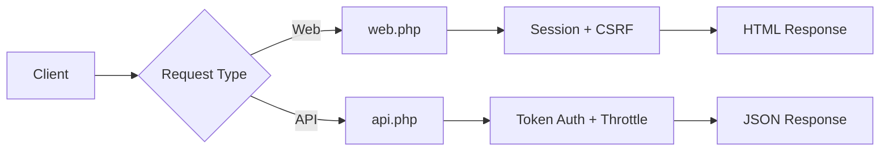

# 3.3 API Routes (การสร้าง API ด้วย Laravel)

> **บทนี้คุณจะได้เรียนรู้**
> - ความแตกต่างระหว่าง Web Routes กับ API Routes
> - การสร้าง RESTful API Routes
> - API Versioning และ Resource Routes
> - การจัดการ Response แบบ JSON

---

## วัตถุประสงค์การเรียนรู้

เมื่อจบบทเรียนนี้ ผู้เรียนจะสามารถ:
1. อธิบายความแตกต่างระหว่าง Web Routes กับ API Routes ได้
2. สร้าง RESTful API Routes ตามมาตรฐานได้
3. จัดการ API Versioning เพื่อรองรับการอัปเดตในอนาคตได้
4. ส่ง Response แบบ JSON ที่มีโครงสร้างเหมาะสมได้

---

## เนื้อหา

### 1. ความแตกต่างระหว่าง Web Routes กับ API Routes

| คุณสมบัติ | `routes/web.php` | `routes/api.php` |
|----------|-----------------|-----------------|
| **Middleware** | `web` (Session, CSRF, Cookies) | `api` (Stateless, Throttle) |
| **Prefix** | ไม่มี | `/api` อัตโนมัติ |
| **Authentication** | Session-based | Token-based (Sanctum, Passport) |
| **Response** | HTML (Blade Views) | JSON |
| **เหมาะกับ** | หน้าเว็บปกติ | Mobile App, SPA, Third-party |

#### Flow: API Request vs Web Request



### 2. การสร้าง API Routes พื้นฐาน

ไฟล์ `routes/api.php`:

```php
use Illuminate\Support\Facades\Route;
use App\Http\Controllers\Api\ProductController;

// GET /api/products
Route::get('/products', [ProductController::class, 'index']);

// GET /api/products/{id}
Route::get('/products/{product}', [ProductController::class, 'show']);

// POST /api/products
Route::post('/products', [ProductController::class, 'store']);

// PUT /api/products/{id}
Route::put('/products/{product}', [ProductController::class, 'update']);

// DELETE /api/products/{id}
Route::delete('/products/{product}', [ProductController::class, 'destroy']);
```

> **หมายเหตุ:** URL จะถูกเติม `/api` ข้างหน้าอัตโนมัติ เช่น `/products` จะกลายเป็น `/api/products`

### 3. API Resource Routes

Laravel มี shortcut สำหรับสร้าง CRUD Routes ทั้งหมดในบรรทัดเดียว:

```php
// สร้าง CRUD Routes ทั้งหมด (index, store, show, update, destroy)
Route::apiResource('products', ProductController::class);

// สร้างหลาย Resource พร้อมกัน
Route::apiResources([
    'products' => ProductController::class,
    'categories' => CategoryController::class,
]);
```

#### เปรียบเทียบ `Route::resource()` vs `Route::apiResource()`

| Method | Routes ที่สร้าง | ไม่มี Routes |
|--------|---------------|-------------|
| `resource()` | 7 routes (CRUD + create, edit) | - |
| `apiResource()` | 5 routes (CRUD เท่านั้น) | `create`, `edit` (ไม่ต้องใช้ใน API) |

### 4. API Versioning

เมื่อ API มีการเปลี่ยนแปลง ควรใช้ Versioning เพื่อไม่ให้กระทบ Client เดิม:

```php
// routes/api.php

// API v1
Route::prefix('v1')->name('api.v1.')->group(function () {
    Route::apiResource('products', App\Http\Controllers\Api\V1\ProductController::class);
    Route::apiResource('users', App\Http\Controllers\Api\V1\UserController::class);
});

// API v2 (เวอร์ชันใหม่)
Route::prefix('v2')->name('api.v2.')->group(function () {
    Route::apiResource('products', App\Http\Controllers\Api\V2\ProductController::class);
});

// URL: /api/v1/products, /api/v2/products
```

### 5. การจัดการ JSON Response

```php
// ใน Controller
public function index()
{
    $products = Product::all();

    return response()->json([
        'status' => 'success',
        'data' => $products,
        'meta' => [
            'total' => $products->count(),
        ]
    ]);
}

public function show(Product $product)
{
    return response()->json([
        'status' => 'success',
        'data' => $product,
    ]);
}

public function store(Request $request)
{
    $validated = $request->validate([
        'name' => 'required|max:255',
        'price' => 'required|numeric|min:0',
    ]);

    $product = Product::create($validated);

    return response()->json([
        'status' => 'success',
        'message' => 'สร้างสินค้าเรียบร้อยแล้ว',
        'data' => $product,
    ], 201);
}
```

#### HTTP Status Codes ที่ใช้บ่อย

| Status Code | ความหมาย | ใช้เมื่อ |
|------------|---------|--------|
| **200** | OK | ดึงข้อมูลสำเร็จ |
| **201** | Created | สร้างข้อมูลใหม่สำเร็จ |
| **204** | No Content | ลบข้อมูลสำเร็จ |
| **400** | Bad Request | ข้อมูลที่ส่งมาไม่ถูกต้อง |
| **401** | Unauthorized | ไม่ได้ Login หรือ Token หมดอายุ |
| **403** | Forbidden | ไม่มีสิทธิ์เข้าถึง |
| **404** | Not Found | ไม่พบข้อมูล |
| **422** | Unprocessable Entity | Validation ไม่ผ่าน |
| **500** | Server Error | เกิดข้อผิดพลาดในระบบ |

---

### การใช้ AI ช่วยพัฒนา

#### Prompt ตัวอย่าง:

```
สร้าง Laravel API Resource Routes สำหรับระบบจัดการบทความ (Articles)
- มี CRUD ครบ
- ใช้ API Versioning (v1)
- มี Rate Limiting 60 requests/minute
- ต้อง Authentication ด้วย Sanctum
```

#### ผลลัพธ์:

```php
Route::prefix('v1')->middleware(['auth:sanctum', 'throttle:60,1'])->group(function () {
    Route::apiResource('articles', ArticleController::class);
});
```

#### การ Review Code จาก AI

เมื่อได้โค้ดจาก AI ให้ตรวจสอบ:
- [ ] HTTP Methods ตรงกับ RESTful Convention หรือไม่
- [ ] Status Codes ที่ส่งกลับเหมาะสมหรือไม่
- [ ] มี Authentication และ Rate Limiting หรือไม่
- [ ] JSON Response มีโครงสร้างที่สม่ำเสมอหรือไม่

---

## แบบฝึกหัด

### Exercise 1: สร้าง API Routes

**โจทย์:** สร้าง API Routes สำหรับระบบจัดการ Tasks โดย:
1. ใช้ `apiResource` สำหรับ CRUD
2. เพิ่ม Route สำหรับ toggle status: `PATCH /api/tasks/{task}/toggle`
3. จัดกลุ่มด้วย prefix `v1`

<details>
<summary>ดูเฉลย</summary>

```php
Route::prefix('v1')->name('api.v1.')->group(function () {
    Route::apiResource('tasks', TaskController::class);
    Route::patch('/tasks/{task}/toggle', [TaskController::class, 'toggle'])
        ->name('tasks.toggle');
});
```

**คำอธิบาย:**
- `apiResource` สร้าง 5 routes: index, store, show, update, destroy
- Route เพิ่มเติมสำหรับ toggle ใช้ `PATCH` เพราะเป็นการอัปเดตบางส่วน
- URL จะเป็น `/api/v1/tasks` และ `/api/v1/tasks/{task}/toggle`

</details>

---

## สรุป

| หัวข้อ | สิ่งที่ได้เรียนรู้ |
|--------|-------------------|
| Web vs API Routes | API ใช้ JSON, Stateless, Token Auth |
| API Resource Routes | `apiResource()` สร้าง 5 CRUD routes |
| API Versioning | ใช้ prefix `v1`, `v2` แยกเวอร์ชัน |
| JSON Response | ใช้ `response()->json()` พร้อม Status Code ที่เหมาะสม |

---

## อ่านเพิ่มเติม

- [Laravel Official Docs - API Resource Routes](https://laravel.com/docs/controllers#api-resource-routes)
- [Laravel Sanctum](https://laravel.com/docs/sanctum)
- [RESTful API Design Best Practices](https://restfulapi.net/)

---

**Navigation:**
[⬅️ ก่อนหน้า](02-advanced-routing.md) | [📚 สารบัญ](../../README.md) | [➡️ ถัดไป](../04-controllers/01-controller-basics.md)
