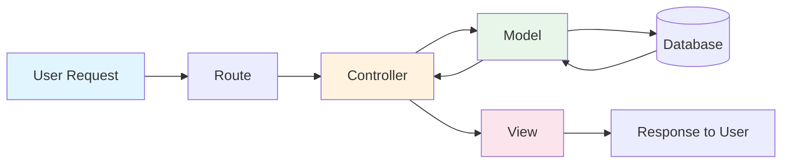
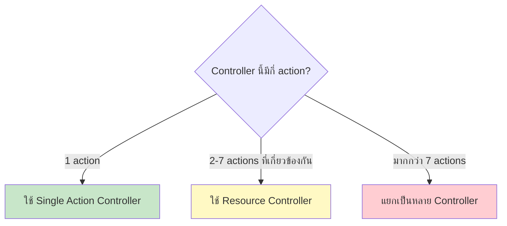
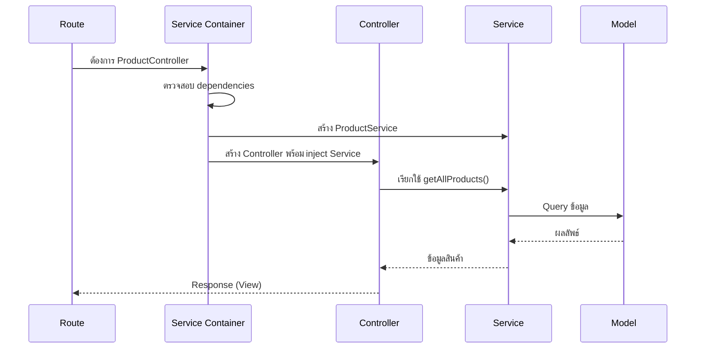

# 4.1 Controller Basics (พื้นฐาน Controller)

> **บทนี้คุณจะได้เรียนรู้**
> - Controller คืออะไร และทำไมต้องใช้
> - การสร้าง Controller ด้วย Artisan Command
> - Single Action Controller (__invoke)
> - Resource Controller สำหรับ CRUD Operations
> - Dependency Injection ใน Controller
> - การเชื่อมต่อ Route กับ Controller

---

## วัตถุประสงค์การเรียนรู้

เมื่อจบบทเรียนนี้ ผู้เรียนจะสามารถ:
1. อธิบายบทบาทของ Controller ในสถาปัตยกรรม MVC ได้
2. สร้าง Controller ด้วย Artisan Command ได้อย่างคล่องแคล่ว
3. เลือกใช้ประเภท Controller ที่เหมาะสมกับงานได้
4. เขียน Resource Controller สำหรับ CRUD Operations ได้สมบูรณ์
5. ใช้ Dependency Injection ใน Controller ได้อย่างถูกต้อง

---

## เนื้อหา

### 1. Controller คืออะไร?

**Controller** คือ class ที่ทำหน้าที่เป็น "ผู้ควบคุม" การทำงานของแอปพลิเคชัน โดยรับ Request จากผู้ใช้ ประมวลผล และส่ง Response กลับไป เปรียบเสมือน **"พนักงานต้อนรับ"** ที่รับคำขอจากลูกค้าแล้วประสานงานกับแผนกต่างๆ

#### ทำไมต้องใช้ Controller?

| ปัญหาเมื่อไม่ใช้ Controller | แก้ไขด้วย Controller |
|------------------------------|---------------------|
| Logic ทั้งหมดอยู่ใน `routes/web.php` | แยก Logic ออกเป็น class ที่จัดการง่าย |
| ไฟล์ Route ยาวมากจนอ่านยาก | Route file สั้นกระชับ อ่านง่าย |
| ไม่สามารถ Reuse โค้ดได้ | สามารถ Reuse method ต่างๆ ได้ |
| ทดสอบยาก | สามารถเขียน Unit Test ได้สะดวก |

#### Flow การทำงานของ Controller ใน MVC



---

### 2. การสร้าง Controller ด้วย Artisan

#### 2.1 สร้าง Controller พื้นฐาน

```bash
# สร้าง Controller เปล่า
php artisan make:controller ProductController

# สร้าง Resource Controller (มี method CRUD ครบ)
php artisan make:controller ProductController --resource

# สร้าง API Resource Controller (ไม่มี create, edit)
php artisan make:controller ProductController --api

# สร้าง Single Action Controller
php artisan make:controller ShowDashboardController --invokable
```

#### 2.2 โครงสร้างไฟล์ Controller

```
app/Http/Controllers/
├── Controller.php            ← Base Controller
├── ProductController.php     ← Resource Controller
├── UserController.php        ← Resource Controller
├── ShowDashboardController.php ← Single Action Controller
└── Admin/
    └── ReportController.php  ← Controller ใน Subfolder
```

#### 2.3 Controller พื้นฐาน

```php
<?php

namespace App\Http\Controllers;

use Illuminate\Http\Request;

class ProductController extends Controller
{
    // method แรก - แสดงรายการสินค้า
    public function index()
    {
        $products = [
            ['id' => 1, 'name' => 'หมูกรอบ', 'price' => 120],
            ['id' => 2, 'name' => 'ข้าวเหนียว', 'price' => 20],
            ['id' => 3, 'name' => 'น้ำพริกหนุ่ม', 'price' => 60],
        ];

        return view('products.index', compact('products'));
    }

    // method แสดงรายละเอียดสินค้า
    public function show(string $id)
    {
        return view('products.show', ['id' => $id]);
    }
}
```

#### การเชื่อม Route กับ Controller

```php
// routes/web.php
use App\Http\Controllers\ProductController;

// เชื่อมแต่ละ method
Route::get('/products', [ProductController::class, 'index']);
Route::get('/products/{id}', [ProductController::class, 'show']);
```

---

### 3. Single Action Controller (__invoke)

Single Action Controller เหมาะสำหรับ Controller ที่ทำงานเพียงอย่างเดียว เช่น แสดงหน้า Dashboard หรือประมวลผลบางอย่าง

```php
<?php

namespace App\Http\Controllers;

use App\Models\User;
use App\Models\Product;
use App\Models\Order;

class ShowDashboardController extends Controller
{
    /**
     * แสดงหน้า Dashboard สรุปข้อมูลทั้งหมด
     */
    public function __invoke()
    {
        // รวบรวมข้อมูลสรุปทั้งหมด
        $stats = [
            'total_users' => User::count(),
            'total_products' => Product::count(),
            'total_orders' => Order::count(),
            'revenue_today' => Order::whereDate('created_at', today())->sum('total'),
        ];

        return view('dashboard', compact('stats'));
    }
}
```

```php
// routes/web.php - ไม่ต้องระบุชื่อ method
Route::get('/dashboard', ShowDashboardController::class);
```

#### เมื่อไหร่ควรใช้ Single Action Controller?



---

### 4. Resource Controller (CRUD)

Resource Controller คือ Controller ที่มี method ครบ 7 ตัวสำหรับจัดการข้อมูลแบบ CRUD (Create, Read, Update, Delete) ตามมาตรฐาน RESTful

#### 4.1 ตาราง 7 Methods มาตรฐาน

| HTTP Method | URI | Controller Method | ใช้สำหรับ |
|-------------|-----|-------------------|----------|
| GET | `/products` | `index()` | แสดงรายการทั้งหมด |
| GET | `/products/create` | `create()` | แสดงฟอร์มสร้างใหม่ |
| POST | `/products` | `store()` | บันทึกข้อมูลใหม่ |
| GET | `/products/{product}` | `show()` | แสดงรายละเอียด |
| GET | `/products/{product}/edit` | `edit()` | แสดงฟอร์มแก้ไข |
| PUT/PATCH | `/products/{product}` | `update()` | อัพเดทข้อมูล |
| DELETE | `/products/{product}` | `destroy()` | ลบข้อมูล |

#### 4.2 ตัวอย่าง ProductController เต็มรูปแบบ

```php
<?php

namespace App\Http\Controllers;

use App\Models\Product;
use Illuminate\Http\Request;

class ProductController extends Controller
{
    /**
     * แสดงรายการสินค้าทั้งหมด
     */
    public function index()
    {
        // ดึงสินค้าทั้งหมดพร้อม Pagination (แสดงหน้าละ 15 รายการ)
        $products = Product::latest()->paginate(15);

        return view('products.index', compact('products'));
    }

    /**
     * แสดงฟอร์มเพิ่มสินค้าใหม่
     */
    public function create()
    {
        return view('products.create');
    }

    /**
     * บันทึกสินค้าใหม่ลงฐานข้อมูล
     */
    public function store(Request $request)
    {
        // ตรวจสอบข้อมูล (Validation)
        $validated = $request->validate([
            'name' => 'required|string|max:255',
            'price' => 'required|numeric|min:0',
            'description' => 'nullable|string',
            'stock' => 'required|integer|min:0',
        ]);

        // สร้างสินค้าใหม่
        $product = Product::create($validated);

        // Redirect พร้อมข้อความสำเร็จ
        return redirect()
            ->route('products.show', $product)
            ->with('success', 'เพิ่มสินค้าเรียบร้อยแล้ว');
    }

    /**
     * แสดงรายละเอียดสินค้า
     */
    public function show(Product $product)
    {
        // Laravel จะ Query หา Product ให้อัตโนมัติ (Route Model Binding)
        return view('products.show', compact('product'));
    }

    /**
     * แสดงฟอร์มแก้ไขสินค้า
     */
    public function edit(Product $product)
    {
        return view('products.edit', compact('product'));
    }

    /**
     * อัพเดทข้อมูลสินค้า
     */
    public function update(Request $request, Product $product)
    {
        $validated = $request->validate([
            'name' => 'required|string|max:255',
            'price' => 'required|numeric|min:0',
            'description' => 'nullable|string',
            'stock' => 'required|integer|min:0',
        ]);

        // อัพเดทข้อมูล
        $product->update($validated);

        return redirect()
            ->route('products.show', $product)
            ->with('success', 'แก้ไขสินค้าเรียบร้อยแล้ว');
    }

    /**
     * ลบสินค้า
     */
    public function destroy(Product $product)
    {
        $product->delete();

        return redirect()
            ->route('products.index')
            ->with('success', 'ลบสินค้าเรียบร้อยแล้ว');
    }
}
```

#### 4.3 การลงทะเบียน Resource Route

```php
// routes/web.php
use App\Http\Controllers\ProductController;

// บรรทัดเดียว ได้ครบ 7 routes
Route::resource('products', ProductController::class);

// ดู routes ทั้งหมดที่สร้างขึ้น
// php artisan route:list
```

#### 4.4 จำกัด Resource Routes

```php
// เลือกเฉพาะบาง method
Route::resource('products', ProductController::class)
    ->only(['index', 'show']);

// ยกเว้นบาง method
Route::resource('products', ProductController::class)
    ->except(['destroy']);
```

---

### 5. Dependency Injection ใน Controller

Laravel Service Container จะ inject dependencies ให้อัตโนมัติผ่าน Constructor หรือ Method Parameters

#### 5.1 Constructor Injection

```php
<?php

namespace App\Http\Controllers;

use App\Services\ProductService;
use App\Repositories\CategoryRepository;

class ProductController extends Controller
{
    // Inject ผ่าน Constructor - ใช้ได้ทุก method
    public function __construct(
        private ProductService $productService,
        private CategoryRepository $categoryRepository
    ) {}

    public function index()
    {
        $products = $this->productService->getAllProducts();
        $categories = $this->categoryRepository->getAll();

        return view('products.index', compact('products', 'categories'));
    }

    public function store(Request $request)
    {
        $product = $this->productService->createProduct($request->validated());

        return redirect()->route('products.show', $product);
    }
}
```

#### 5.2 Method Injection

```php
class UserController extends Controller
{
    /**
     * Method Injection - inject เฉพาะ method ที่ต้องการ
     * Request จะถูก inject อัตโนมัติ
     */
    public function store(Request $request)
    {
        $validated = $request->validate([
            'name' => 'required|string|max:255',
            'email' => 'required|email|unique:users',
        ]);

        $user = User::create($validated);

        return redirect()->route('users.show', $user);
    }

    /**
     * ผสม Route Parameter กับ Injection
     * Laravel จะ inject Request และ resolve User จาก Route
     */
    public function update(Request $request, User $user)
    {
        $user->update($request->validated());

        return redirect()->route('users.show', $user);
    }
}
```

#### Diagram: การทำงานของ Dependency Injection



---

### 6. Route Model Binding

Laravel สามารถ inject Model instance ผ่าน Route Parameter ได้โดยอัตโนมัติ

```php
// Route ที่กำหนด parameter {product}
Route::get('/products/{product}', [ProductController::class, 'show']);

// Controller - Laravel จะ Query หา Product โดยอัตโนมัติ
// ถ้าหาไม่เจอจะ return 404
public function show(Product $product)
{
    // $product คือ instance ของ Product ที่ Query มาแล้ว
    // ไม่ต้องเขียน Product::findOrFail($id) เอง
    return view('products.show', compact('product'));
}
```

#### Customizing Route Model Binding

```php
// ใน Model - กำหนดให้ค้นหาด้วย column อื่นแทน id
class Product extends Model
{
    /**
     * ให้ค้นหาจาก slug แทน id
     */
    public function getRouteKeyName(): string
    {
        return 'slug';
    }
}

// URL จะเป็น /products/nam-prik-num แทน /products/1
```

---

### 7. ตัวอย่างเพิ่มเติม: UserController

```php
<?php

namespace App\Http\Controllers;

use App\Models\User;
use App\Models\Role;
use Illuminate\Http\Request;
use Illuminate\Support\Facades\Hash;

class UserController extends Controller
{
    public function index()
    {
        $users = User::with('role')->latest()->paginate(20);

        return view('users.index', compact('users'));
    }

    public function create()
    {
        $roles = Role::all();

        return view('users.create', compact('roles'));
    }

    public function store(Request $request)
    {
        $validated = $request->validate([
            'name' => 'required|string|max:255',
            'email' => 'required|email|unique:users',
            'password' => 'required|min:8|confirmed',
            'role_id' => 'required|exists:roles,id',
        ]);

        $validated['password'] = Hash::make($validated['password']);

        $user = User::create($validated);

        return redirect()
            ->route('users.index')
            ->with('success', "เพิ่มผู้ใช้ {$user->name} เรียบร้อยแล้ว");
    }

    public function show(User $user)
    {
        $user->load(['role', 'orders']);

        return view('users.show', compact('user'));
    }

    public function edit(User $user)
    {
        $roles = Role::all();

        return view('users.edit', compact('user', 'roles'));
    }

    public function update(Request $request, User $user)
    {
        $validated = $request->validate([
            'name' => 'required|string|max:255',
            'email' => "required|email|unique:users,email,{$user->id}",
            'role_id' => 'required|exists:roles,id',
        ]);

        $user->update($validated);

        return redirect()
            ->route('users.show', $user)
            ->with('success', 'แก้ไขข้อมูลผู้ใช้เรียบร้อยแล้ว');
    }

    public function destroy(User $user)
    {
        // ป้องกันการลบตัวเอง
        if ($user->id === auth()->id()) {
            return back()->with('error', 'ไม่สามารถลบบัญชีตัวเองได้');
        }

        $user->delete();

        return redirect()
            ->route('users.index')
            ->with('success', 'ลบผู้ใช้เรียบร้อยแล้ว');
    }
}
```

---

### การใช้ AI ช่วยสร้าง Controller

#### Prompt ตัวอย่าง:

```
สร้าง Laravel Resource Controller ชื่อ CategoryController
- มี CRUD ครบ 7 methods
- ใช้ Route Model Binding
- มี Validation ใน store และ update
- fields: name (required, max 100), description (nullable), is_active (boolean)
- ใช้ Pagination หน้าละ 10 รายการ
- มี Flash Message ภาษาไทย
```

#### การ Review Code จาก AI

เมื่อได้โค้ดจาก AI ให้ตรวจสอบ:
- [ ] Namespace และ import ถูกต้องหรือไม่
- [ ] Validation rules ครบถ้วนและเหมาะสมหรือไม่
- [ ] ใช้ Route Model Binding แทน `findOrFail()` หรือยัง
- [ ] มีการจัดการ Error กรณีต่างๆ หรือไม่
- [ ] Flash message เหมาะสมกับภาษาที่ใช้หรือไม่

---

## แบบฝึกหัด

### Exercise 1: สร้าง BookController

**โจทย์:**
สร้าง Resource Controller สำหรับจัดการหนังสือ (Book) โดยมี fields: title, author, isbn, price, published_year

**เป้าหมาย:**
1. สร้าง Controller ด้วย Artisan command
2. เขียน CRUD methods ครบทั้ง 7
3. เพิ่ม Validation ที่เหมาะสม
4. ลงทะเบียน Resource Route

**Hints:**
- ใช้ `php artisan make:controller BookController --resource`
- isbn ควรมี validation `unique:books`
- price ควรเป็น `numeric|min:0`

<details>
<summary>ดูเฉลย</summary>

```php
<?php

namespace App\Http\Controllers;

use App\Models\Book;
use Illuminate\Http\Request;

class BookController extends Controller
{
    public function index()
    {
        $books = Book::latest()->paginate(15);
        return view('books.index', compact('books'));
    }

    public function create()
    {
        return view('books.create');
    }

    public function store(Request $request)
    {
        $validated = $request->validate([
            'title' => 'required|string|max:255',
            'author' => 'required|string|max:255',
            'isbn' => 'required|string|unique:books,isbn',
            'price' => 'required|numeric|min:0',
            'published_year' => 'required|integer|min:1900|max:' . date('Y'),
        ]);

        $book = Book::create($validated);

        return redirect()
            ->route('books.show', $book)
            ->with('success', 'เพิ่มหนังสือเรียบร้อยแล้ว');
    }

    public function show(Book $book)
    {
        return view('books.show', compact('book'));
    }

    public function edit(Book $book)
    {
        return view('books.edit', compact('book'));
    }

    public function update(Request $request, Book $book)
    {
        $validated = $request->validate([
            'title' => 'required|string|max:255',
            'author' => 'required|string|max:255',
            'isbn' => "required|string|unique:books,isbn,{$book->id}",
            'price' => 'required|numeric|min:0',
            'published_year' => 'required|integer|min:1900|max:' . date('Y'),
        ]);

        $book->update($validated);

        return redirect()
            ->route('books.show', $book)
            ->with('success', 'แก้ไขหนังสือเรียบร้อยแล้ว');
    }

    public function destroy(Book $book)
    {
        $book->delete();

        return redirect()
            ->route('books.index')
            ->with('success', 'ลบหนังสือเรียบร้อยแล้ว');
    }
}
```

```php
// routes/web.php
Route::resource('books', BookController::class);
```

**คำอธิบาย:**
- ใช้ Route Model Binding ทุก method ที่ต้องการ Book instance
- isbn มี unique validation และยกเว้นตัวเองตอน update
- published_year จำกัดช่วงปีที่สมเหตุสมผล
- ทุก method ที่เปลี่ยนแปลงข้อมูลมี flash message ภาษาไทย

</details>

### Exercise 2: สร้าง Single Action Controller

**โจทย์:**
สร้าง `ExportProductsController` ที่ทำหน้าที่ export รายการสินค้าเป็น CSV

**เป้าหมาย:**
1. สร้าง Single Action Controller ด้วย `--invokable`
2. Query สินค้าทั้งหมดใน `__invoke()`
3. ส่งกลับเป็น CSV Response

<details>
<summary>ดูเฉลย</summary>

```php
<?php

namespace App\Http\Controllers;

use App\Models\Product;
use Symfony\Component\HttpFoundation\StreamedResponse;

class ExportProductsController extends Controller
{
    public function __invoke(): StreamedResponse
    {
        $products = Product::all();

        return response()->streamDownload(function () use ($products) {
            $handle = fopen('php://output', 'w');

            // หัวตาราง
            fputcsv($handle, ['ID', 'ชื่อสินค้า', 'ราคา', 'จำนวนคงเหลือ']);

            // ข้อมูลแต่ละแถว
            foreach ($products as $product) {
                fputcsv($handle, [
                    $product->id,
                    $product->name,
                    $product->price,
                    $product->stock,
                ]);
            }

            fclose($handle);
        }, 'products.csv', [
            'Content-Type' => 'text/csv',
        ]);
    }
}
```

```php
// routes/web.php
Route::get('/products/export', ExportProductsController::class)
    ->name('products.export');
```

</details>

---

## Resources เพิ่มเติม

- [Laravel Controllers - Official Documentation](https://laravel.com/docs/11.x/controllers)
- [Laravel Route Model Binding](https://laravel.com/docs/11.x/routing#route-model-binding)
- [Laravel Service Container](https://laravel.com/docs/11.x/container)

---

## สรุป

| หัวข้อ | สิ่งที่ได้เรียนรู้ |
|--------|-------------------|
| Controller คืออะไร | Class ที่จัดการ Request/Response ในรูปแบบ MVC |
| Artisan Commands | `make:controller` พร้อม flags `--resource`, `--api`, `--invokable` |
| Single Action | ใช้ `__invoke()` สำหรับ Controller ที่ทำงานเพียงอย่างเดียว |
| Resource Controller | 7 methods มาตรฐาน: index, create, store, show, edit, update, destroy |
| Dependency Injection | Inject ผ่าน Constructor หรือ Method Parameter |
| Route Model Binding | Laravel ค้นหา Model ให้อัตโนมัติจาก Route Parameter |

---

**Navigation:**
[ก่อนหน้า: API Routes](../03-routing/03-api-routes.md) | [สารบัญ](../../README.md) | [ถัดไป: Best Practices](02-best-practices.md)
