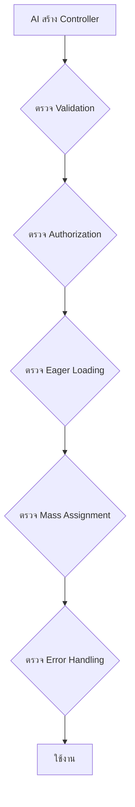

# 4.3 AI-Assisted Development (การใช้ AI ช่วยพัฒนา Controller)

> **บทนี้คุณจะได้เรียนรู้**
> - การใช้ AI สร้าง Controller
> - Prompt ที่มีประสิทธิภาพสำหรับ Controller
> - การ Review โค้ด Controller จาก AI
> - ข้อควรระวังและการปรับปรุง

---

## วัตถุประสงค์การเรียนรู้

เมื่อจบบทเรียนนี้ ผู้เรียนจะสามารถ:
1. เขียน Prompt สำหรับสร้าง Controller ที่ได้ผลลัพธ์ดีได้
2. ตรวจสอบและปรับปรุงโค้ด Controller จาก AI ได้
3. ใช้ AI ช่วย Refactor Controller ที่มีอยู่ได้

---

## เนื้อหา

### 1. Prompt สำหรับสร้าง Controller

```
สร้าง Laravel Resource Controller ชื่อ ProductController ที่มี:
- ใช้ Route Model Binding
- index(): แสดงรายการพร้อม Pagination 10 รายการ, ค้นหาด้วย name, กรองด้วย category_id
- create(): แสดงฟอร์ม พร้อมส่ง categories
- store(): ใช้ StoreProductRequest, อัปโหลดรูปภาพไปที่ products/
- show(): Eager Load category และ user
- edit(): แสดงฟอร์มแก้ไข พร้อมค่าเดิม
- update(): ใช้ UpdateProductRequest, จัดการรูปภาพเก่า/ใหม่
- destroy(): ลบรูปภาพ + ลบข้อมูล
- ทุก method มี Flash Message
```

### 2. ตัวอย่าง Prompt เฉพาะทาง

| สถานการณ์ | Prompt |
|----------|--------|
| **สร้าง Form Request** | "สร้าง StoreProductRequest ที่มี rules สำหรับ name, price, category_id, image พร้อม messages ภาษาไทย" |
| **สร้าง API Resource** | "สร้าง ProductResource ที่แสดง id, name, price, formatted_price, category (nested), created_at" |
| **Refactor** | "Refactor Controller นี้ให้ใช้ Form Request แทน inline validation และแยก file upload logic" |
| **เพิ่มฟีเจอร์** | "เพิ่ม method export() ใน ProductController สำหรับ Export CSV" |

### 3. การ Review โค้ดจาก AI



**Checklist สำหรับ Review:**

| รายการตรวจสอบ | ตรวจอะไร |
|--------------|---------|
| **Validation** | มี Validation ครบทุก field หรือไม่ |
| **Authorization** | มีการตรวจสิทธิ์หรือไม่ |
| **Eager Loading** | ใช้ `with()` ป้องกัน N+1 หรือไม่ |
| **Mass Assignment** | ใช้ `$request->validated()` หรือไม่ |
| **File Handling** | ลบไฟล์เก่าเมื่อ Update/Delete หรือไม่ |
| **Flash Message** | มี Feedback ให้ผู้ใช้หรือไม่ |
| **Redirect** | Redirect ไปหน้าที่ถูกต้องหรือไม่ |

### 4. ตัวอย่าง: ให้ AI Refactor

**Prompt:**
```
Refactor Controller นี้ให้ดีขึ้น:
- แยก Validation เป็น Form Request
- เพิ่ม Eager Loading
- เพิ่ม Flash Message
- จัดการ File Upload ให้ถูกต้อง

[วาง Controller เดิมที่ต้องการ Refactor]
```

### 5. ข้อควรระวัง

| ข้อควรระวัง | รายละเอียด |
|------------|-----------|
| **อย่าใช้โดยไม่ตรวจ** | AI อาจลืม Validation บาง field |
| **Security** | ตรวจสอบ Mass Assignment, Authorization |
| **Convention** | ตรวจว่าตรงตาม Laravel Convention |
| **N+1 Query** | AI มักลืม Eager Loading |
| **Error Handling** | AI มักไม่ใส่ try-catch |

---

## แบบฝึกหัด

### Exercise 1: ใช้ AI สร้าง Controller

**โจทย์:** ใช้ AI สร้าง `CategoryController` (Resource Controller) ที่มี CRUD ครบ พร้อม Validation และ Flash Message

<details>
<summary>ดูเฉลย Prompt</summary>

```
สร้าง Laravel Resource Controller ชื่อ CategoryController:
- index(): แสดงรายการ categories ทั้งหมด พร้อม withCount('products')
- create(): แสดงฟอร์มสร้าง
- store(): validate name (required, unique, max:255) แล้ว create
- edit(): แสดงฟอร์มแก้ไข
- update(): validate name (required, unique ยกเว้นตัวเอง, max:255) แล้ว update
- destroy(): ตรวจว่าไม่มี products ก่อนลบ ถ้ามีให้แจ้ง error
- ทุก method มี Flash Message ภาษาไทย
- ใช้ Route Model Binding
```

</details>

---

## สรุป

| หัวข้อ | สิ่งที่ได้เรียนรู้ |
|--------|-------------------|
| Prompt | ระบุ Method, Validation, Relationship ให้ชัดเจน |
| Review | ตรวจ Validation, Auth, Eager Loading, Mass Assignment |
| Refactor | ให้ AI ช่วย Refactor โค้ดเดิมให้ดีขึ้น |
| ข้อควรระวัง | ตรวจสอบ Security และ Convention เสมอ |

---

**Navigation:**
[⬅️ ก่อนหน้า](02-best-practices.md) | [📚 สารบัญ](../../README.md) | [➡️ ถัดไป](../05-models-eloquent/01-eloquent-introduction.md)
