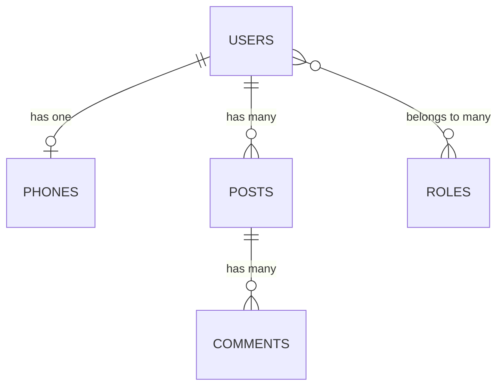
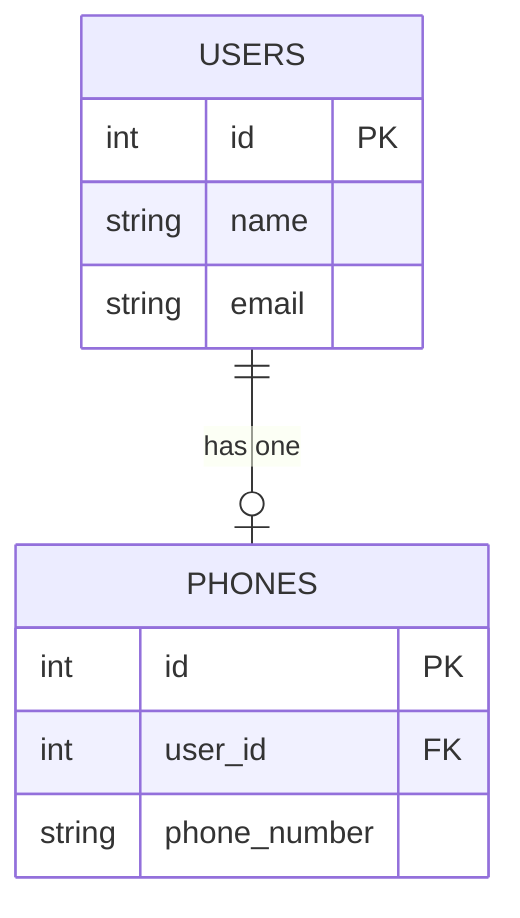
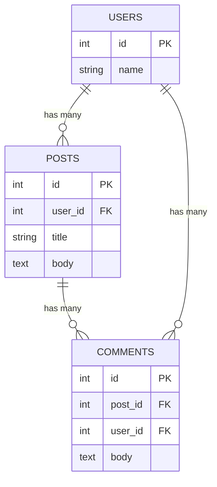
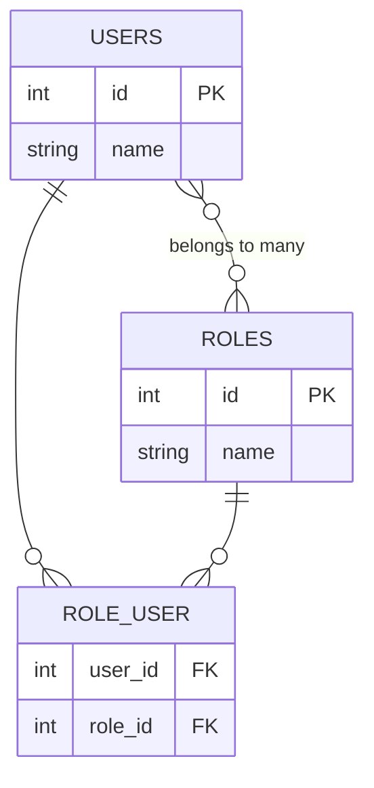
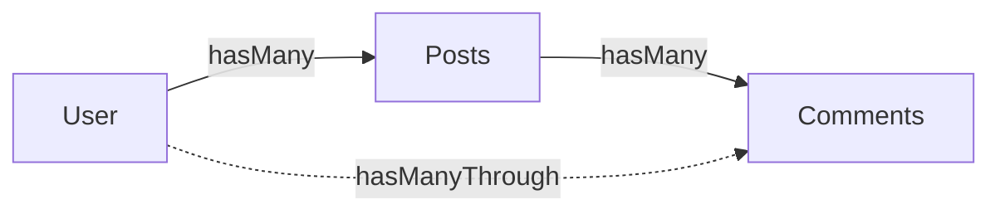
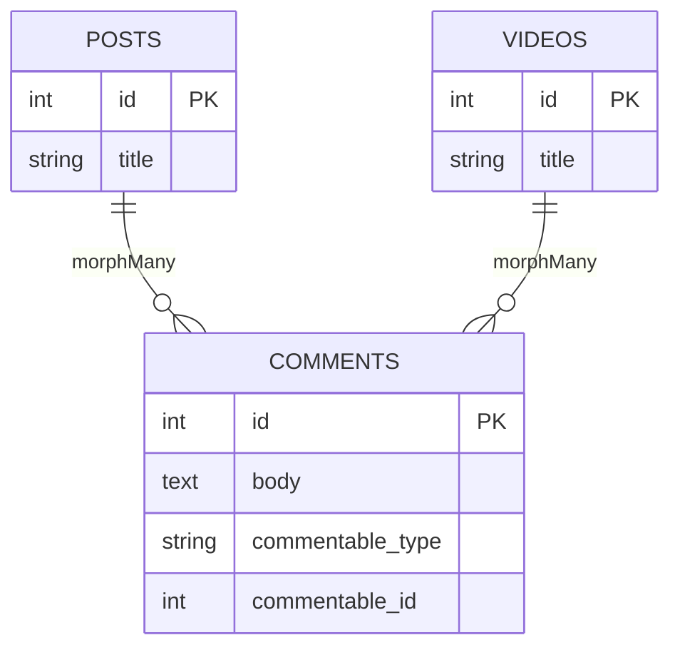
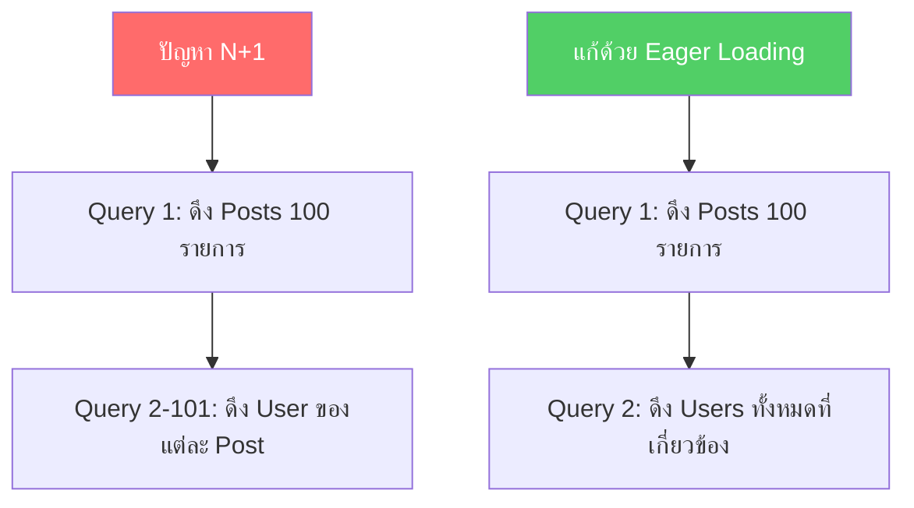

# 5.3 Eloquent Relationships (ความสัมพันธ์ของข้อมูล)

> **บทนี้คุณจะได้เรียนรู้**
> - ความสัมพันธ์แบบ One to One, One to Many, Many to Many
> - Has Many Through และ Polymorphic Relations
> - Eager Loading เพื่อแก้ปัญหา N+1 Query
> - การสร้างและอัปเดตข้อมูลที่มีความสัมพันธ์กัน

---

## วัตถุประสงค์การเรียนรู้

เมื่อจบบทเรียนนี้ ผู้เรียนจะสามารถ:
1. อธิบายความสัมพันธ์แบบ One to One, One to Many, Many to Many ได้
2. ใช้ Has Many Through และ Polymorphic Relations ได้
3. แก้ปัญหา N+1 Query ด้วย Eager Loading ได้
4. สร้างและจัดการข้อมูลที่มีความสัมพันธ์กันได้

เพื่อให้เข้าใจการเชื่อมโยงข้อมูลระหว่างตารางต่าง ๆ ผ่าน Eloquent Relationships ซึ่งเป็นหัวใจสำคัญของการพัฒนาแอปพลิเคชันที่มีข้อมูลซับซ้อน เช่น ระบบบล็อก ระบบ E-commerce หรือระบบจัดการนักศึกษา

---

## เนื้อหา

### 1. ทำไมต้องใช้ Relationships?

ในระบบจริง ข้อมูลมักจะเกี่ยวข้องกัน เช่น ผู้ใช้มีหลายโพสต์ โพสต์มีหลายความคิดเห็น สินค้ามีหลายหมวดหมู่ Eloquent ช่วยให้เราจัดการความสัมพันธ์เหล่านี้ได้ง่ายด้วย Method ที่อ่านเข้าใจง่าย โดยไม่ต้องเขียน SQL JOIN เอง



---

### 2. One to One (hasOne / belongsTo)

ความสัมพันธ์แบบหนึ่งต่อหนึ่ง เช่น ผู้ใช้ 1 คนมีเบอร์โทรศัพท์ 1 เบอร์



#### Migration

```php
// create_phones_table migration
Schema::create('phones', function (Blueprint $table) {
    $table->id();
    $table->foreignId('user_id')->constrained()->onDelete('cascade');
    $table->string('phone_number');
    $table->timestamps();
});
```

#### 💡 Model: User.php

```php
class User extends Authenticatable
{
    // ผู้ใช้ 1 คน "มี" โทรศัพท์ 1 เครื่อง
    public function phone(): HasOne
    {
        return $this->hasOne(Phone::class);
    }
}
```

#### Model: Phone.php

```php
class Phone extends Model
{
    protected $fillable = ['user_id', 'phone_number'];

    // โทรศัพท์ "เป็นของ" ผู้ใช้ 1 คน
    public function user(): BelongsTo
    {
        return $this->belongsTo(User::class);
    }
}
```

#### การใช้งาน

```php
// ดึงเบอร์โทรของผู้ใช้
$user = User::find(1);
echo $user->phone->phone_number; // เข้าถึงผ่าน property

// ดึงเจ้าของโทรศัพท์
$phone = Phone::find(1);
echo $phone->user->name; // ย้อนกลับได้
```

---

### 3. One to Many (hasMany / belongsTo)

ความสัมพันธ์ที่ใช้บ่อยที่สุด เช่น ผู้ใช้ 1 คนมีหลายโพสต์ โพสต์ 1 โพสต์มีหลายความคิดเห็น



#### Model: User.php

```php
class User extends Authenticatable
{
    // ผู้ใช้ 1 คน "มีหลาย" โพสต์
    public function posts(): HasMany
    {
        return $this->hasMany(Post::class);
    }

    // ผู้ใช้ 1 คน "มีหลาย" ความคิดเห็น
    public function comments(): HasMany
    {
        return $this->hasMany(Comment::class);
    }
}
```

#### Model: Post.php

```php
class Post extends Model
{
    protected $fillable = ['user_id', 'title', 'body'];

    // โพสต์ "เป็นของ" ผู้ใช้ 1 คน
    public function user(): BelongsTo
    {
        return $this->belongsTo(User::class);
    }

    // โพสต์ "มีหลาย" ความคิดเห็น
    public function comments(): HasMany
    {
        return $this->hasMany(Comment::class);
    }
}
```

#### Model: Comment.php

```php
class Comment extends Model
{
    protected $fillable = ['post_id', 'user_id', 'body'];

    public function post(): BelongsTo
    {
        return $this->belongsTo(Post::class);
    }

    public function user(): BelongsTo
    {
        return $this->belongsTo(User::class);
    }
}
```

#### การใช้งาน

```php
// ดึงโพสต์ทั้งหมดของผู้ใช้
$user = User::find(1);
foreach ($user->posts as $post) {
    echo $post->title;
}

// นับจำนวนความคิดเห็นของโพสต์
$post = Post::find(1);
echo $post->comments->count(); // จำนวนคอมเมนต์

// ดึงชื่อเจ้าของโพสต์
echo $post->user->name;
```

---

### 4. Many to Many (belongsToMany)

ความสัมพันธ์แบบหลายต่อหลาย เช่น ผู้ใช้หลายคนมีหลายบทบาท (Roles) ต้องมี **Pivot Table** เป็นตัวกลาง



#### Migration สำหรับ Pivot Table

```php
// ชื่อตาราง pivot ต้องเรียงตามตัวอักษร: role_user (ไม่ใช่ user_role)
Schema::create('role_user', function (Blueprint $table) {
    $table->id();
    $table->foreignId('user_id')->constrained()->onDelete('cascade');
    $table->foreignId('role_id')->constrained()->onDelete('cascade');
    $table->timestamps();

    // ป้องกันข้อมูลซ้ำ
    $table->unique(['user_id', 'role_id']);
});
```

#### Models

```php
// User.php
class User extends Authenticatable
{
    public function roles(): BelongsToMany
    {
        return $this->belongsToMany(Role::class)
                    ->withTimestamps(); // เก็บเวลาใน pivot ด้วย
    }
}

// Role.php
class Role extends Model
{
    public function users(): BelongsToMany
    {
        return $this->belongsToMany(User::class)
                    ->withTimestamps();
    }
}
```

#### การจัดการข้อมูล Pivot

```php
$user = User::find(1);

// เพิ่ม Role ให้ผู้ใช้
$user->roles()->attach(1);                   // เพิ่ม role_id = 1
$user->roles()->attach([1, 2, 3]);           // เพิ่มหลาย roles

// ลบ Role ออกจากผู้ใช้
$user->roles()->detach(1);                   // ลบ role_id = 1
$user->roles()->detach();                    // ลบทุก role

// Sync - กำหนด roles ใหม่ทั้งหมด (ลบของเก่าที่ไม่ได้ระบุออก)
$user->roles()->sync([1, 3]);               // ผู้ใช้จะมีแค่ role 1 กับ 3

// Toggle - สลับสถานะ (มีอยู่ก็ลบ ไม่มีก็เพิ่ม)
$user->roles()->toggle([1, 2]);

// ดึงข้อมูลจาก pivot
foreach ($user->roles as $role) {
    echo $role->pivot->created_at; // เข้าถึงข้อมูลใน pivot table
}
```

---

### 5. Has Many Through

ดึงข้อมูลที่ห่างออกไปอีกระดับ เช่น ดึงความคิดเห็นทั้งหมดของผู้ใช้ ผ่านโพสต์



```php
// User.php
class User extends Authenticatable
{
    // ดึง Comments ทั้งหมดผ่าน Posts โดยไม่ต้อง loop เอง
    public function allComments(): HasManyThrough
    {
        return $this->hasManyThrough(Comment::class, Post::class);
    }
}

// การใช้งาน
$user = User::find(1);
$comments = $user->allComments; // ได้ comments ทั้งหมดจากทุกโพสต์ของ user
```

---

### 6. Polymorphic Relations (ความสัมพันธ์แบบ Polymorphic)

ใช้เมื่อ Model หนึ่งสามารถเป็นของหลาย Model เช่น ทั้ง Post และ Video สามารถมี Comments ได้



#### Migration

```php
Schema::create('comments', function (Blueprint $table) {
    $table->id();
    $table->text('body');
    $table->morphs('commentable'); // สร้าง commentable_type และ commentable_id
    $table->timestamps();
});
```

#### Models

```php
// Comment.php
class Comment extends Model
{
    public function commentable(): MorphTo
    {
        return $this->morphTo(); // ชี้ไปได้ทั้ง Post และ Video
    }
}

// Post.php
class Post extends Model
{
    public function comments(): MorphMany
    {
        return $this->morphMany(Comment::class, 'commentable');
    }
}

// Video.php
class Video extends Model
{
    public function comments(): MorphMany
    {
        return $this->morphMany(Comment::class, 'commentable');
    }
}
```

#### การใช้งาน

```php
// เพิ่ม comment ให้ Post
$post = Post::find(1);
$post->comments()->create(['body' => 'โพสต์ดีมากครับ']);

// เพิ่ม comment ให้ Video
$video = Video::find(1);
$video->comments()->create(['body' => 'วิดีโอสนุกมาก']);

// ดึง parent จาก comment
$comment = Comment::find(1);
$parent = $comment->commentable; // อาจเป็น Post หรือ Video ก็ได้
```

---

### 7. Eager Loading (แก้ปัญหา N+1 Query)

ปัญหา N+1 เกิดเมื่อเราดึงข้อมูล N รายการ แล้ว loop ดึง relationship ทีละรายการ ทำให้ยิง query เกินจำเป็น



#### ตัวอย่างปัญหา N+1 (ห้ามทำแบบนี้!)

```php
// ❌ แบบนี้จะยิง 101 queries (1 + 100)
$posts = Post::all(); // Query 1: SELECT * FROM posts

foreach ($posts as $post) {
    echo $post->user->name; // Query 2-101: SELECT * FROM users WHERE id = ?
}
```

#### แก้ไขด้วย with() - Eager Loading

```php
// ✅ แบบนี้ยิงแค่ 2 queries
$posts = Post::with('user')->get();
// Query 1: SELECT * FROM posts
// Query 2: SELECT * FROM users WHERE id IN (1, 2, 3, ...)

foreach ($posts as $post) {
    echo $post->user->name; // ไม่ยิง query เพิ่ม!
}
```

#### Eager Loading หลาย Relationships

```php
// โหลดหลาย relationships พร้อมกัน
$posts = Post::with(['user', 'comments', 'tags'])->get();

// Nested Eager Loading - โหลดลึกหลายชั้น
$posts = Post::with(['comments.user'])->get();
// ดึง comments พร้อม user ของแต่ละ comment

// Eager Loading พร้อมเงื่อนไข
$posts = Post::with(['comments' => function ($query) {
    $query->where('approved', true)
          ->orderBy('created_at', 'desc');
}])->get();
```

#### Lazy Eager Loading (โหลดทีหลัง)

```php
$posts = Post::all();

// โหลด relationship ทีหลังเมื่อต้องการ
$posts->load('user');
$posts->load(['user', 'comments']);
```

---

### 8. การสร้างและอัปเดตข้อมูลที่สัมพันธ์กัน

```php
// สร้าง Post พร้อมกำหนดเจ้าของ
$user = User::find(1);
$post = $user->posts()->create([
    'title' => 'โพสต์แรกของฉัน',
    'body'  => 'เนื้อหาของโพสต์',
]);

// สร้าง Comment ใน Post
$post->comments()->create([
    'user_id' => auth()->id(),
    'body'    => 'ความคิดเห็นแรก!',
]);

// ใช้ associate สำหรับ belongsTo
$comment = new Comment(['body' => 'คอมเมนต์ใหม่']);
$comment->post()->associate($post);
$comment->user()->associate($user);
$comment->save();

// ใช้ saveMany สร้างหลายรายการพร้อมกัน
$post->comments()->saveMany([
    new Comment(['user_id' => 1, 'body' => 'คอมเมนต์ 1']),
    new Comment(['user_id' => 2, 'body' => 'คอมเมนต์ 2']),
]);
```

---

### การใช้ AI ช่วยพัฒนา

#### Prompt ตัวอย่าง 1: ออกแบบ Relationships

```
ช่วยออกแบบ Eloquent Relationships สำหรับระบบ E-commerce ที่มี:
- Users สามารถสั่งซื้อ Orders ได้หลายรายการ
- แต่ละ Order มีหลาย OrderItems
- Products สามารถอยู่ในหลาย Categories (Many to Many)
- Products มีหลาย Reviews จาก Users

ช่วยเขียน Model พร้อม relationships, migrations, และตัวอย่างการใช้ Eager Loading
```

#### Prompt ตัวอย่าง 2: แก้ปัญหา N+1

```
โค้ดนี้มีปัญหา N+1 query ช่วยแก้ไขด้วย Eager Loading:

$orders = Order::all();
foreach ($orders as $order) {
    echo $order->user->name;
    foreach ($order->items as $item) {
        echo $item->product->name;
    }
}
```

#### ผลลัพธ์จาก AI:

```php
// แก้ไขด้วย Nested Eager Loading
$orders = Order::with(['user', 'items.product'])->get();

foreach ($orders as $order) {
    echo $order->user->name;        // ไม่มี query เพิ่ม
    foreach ($order->items as $item) {
        echo $item->product->name;  // ไม่มี query เพิ่ม
    }
}
```

#### การ Review Code จาก AI

เมื่อ AI สร้าง Relationships ให้ ตรวจสอบสิ่งเหล่านี้:
1. **ชื่อ Foreign Key** - ถูกต้องตาม Convention หรือไม่ (เช่น `user_id` ไม่ใช่ `userId`)
2. **Return Type** - ระบุ return type ที่ถูกต้อง (`HasOne`, `HasMany`, `BelongsToMany`)
3. **Cascade Delete** - มีการตั้งค่า `onDelete('cascade')` เมื่อจำเป็นหรือไม่
4. **Pivot Table** - ชื่อเรียงตามตัวอักษรหรือไม่ (เช่น `role_user` ไม่ใช่ `user_role`)
5. **N+1 Problem** - ใช้ `with()` ทุกครั้งที่ดึงข้อมูลที่มี relationship หรือไม่

---

## แบบฝึกหัด

### Exercise 1: ระบบบล็อกมหาวิทยาลัย

**โจทย์:** สร้างระบบบล็อกสำหรับ มร.ชม. ที่มีโครงสร้างดังนี้:
- อาจารย์ (Teacher) มีหลายบทความ (Articles)
- บทความมีหลายความคิดเห็น (Comments)
- บทความมีหลายแท็ก (Tags) แบบ Many to Many

**เป้าหมาย:**
- สร้าง Models ที่มี Relationships ครบถ้วน
- สร้าง Migrations ที่มี Foreign Keys
- เขียนโค้ดดึงข้อมูลด้วย Eager Loading

**Hints:**
- ใช้ `belongsToMany` สำหรับ Tags
- อย่าลืมสร้าง pivot table `article_tag`

<details>
<summary>💡 ดูเฉลย</summary>

```php
// Migration: create_articles_table
Schema::create('articles', function (Blueprint $table) {
    $table->id();
    $table->foreignId('teacher_id')->constrained()->onDelete('cascade');
    $table->string('title');
    $table->text('body');
    $table->timestamps();
});

// Migration: create_tags_table
Schema::create('tags', function (Blueprint $table) {
    $table->id();
    $table->string('name')->unique();
    $table->timestamps();
});

// Migration: create_article_tag_table (pivot)
Schema::create('article_tag', function (Blueprint $table) {
    $table->foreignId('article_id')->constrained()->onDelete('cascade');
    $table->foreignId('tag_id')->constrained()->onDelete('cascade');
    $table->primary(['article_id', 'tag_id']);
});

// Teacher.php
class Teacher extends Model
{
    public function articles(): HasMany
    {
        return $this->hasMany(Article::class);
    }
}

// Article.php
class Article extends Model
{
    protected $fillable = ['teacher_id', 'title', 'body'];

    public function teacher(): BelongsTo
    {
        return $this->belongsTo(Teacher::class);
    }

    public function comments(): HasMany
    {
        return $this->hasMany(Comment::class);
    }

    public function tags(): BelongsToMany
    {
        return $this->belongsToMany(Tag::class);
    }
}

// การใช้งานด้วย Eager Loading
$articles = Article::with(['teacher', 'comments', 'tags'])
    ->latest()
    ->paginate(10);
```

**คำอธิบาย:**
- ใช้ `foreignId()->constrained()` เพื่อสร้าง Foreign Key อัตโนมัติ
- Pivot table `article_tag` ตั้งชื่อตามตัวอักษร (article ก่อน tag)
- ใช้ `with()` เพื่อ Eager Load ทุก relationship ป้องกัน N+1

</details>

### Exercise 2: วิเคราะห์ปัญหา N+1

**โจทย์:** โค้ดด้านล่างมีปัญหา N+1 Query กี่จุด? จงแก้ไขให้ถูกต้อง

```php
$teachers = Teacher::all();

foreach ($teachers as $teacher) {
    echo $teacher->department->name;
    foreach ($teacher->articles as $article) {
        echo $article->title;
        echo $article->comments->count();
        foreach ($article->tags as $tag) {
            echo $tag->name;
        }
    }
}
```

<details>
<summary>💡 ดูเฉลย</summary>

```php
// มีปัญหา N+1 ทั้งหมด 4 จุด:
// 1. department ของแต่ละ teacher
// 2. articles ของแต่ละ teacher
// 3. comments ของแต่ละ article
// 4. tags ของแต่ละ article

// แก้ไขด้วย Nested Eager Loading:
$teachers = Teacher::with([
    'department',
    'articles.comments',
    'articles.tags',
])->get();

// ตอนนี้ทุก loop ไม่ยิง query เพิ่มแล้ว
foreach ($teachers as $teacher) {
    echo $teacher->department->name;
    foreach ($teacher->articles as $article) {
        echo $article->title;
        echo $article->comments->count();
        foreach ($article->tags as $tag) {
            echo $tag->name;
        }
    }
}
```

**คำอธิบาย:**
- `with(['department', 'articles.comments', 'articles.tags'])` โหลดทุกอย่างล่วงหน้า
- จาก query หลายสิบรายการ เหลือเพียง 5 queries เท่านั้น

</details>

---

## อ่านเพิ่มเติม

- [Laravel Eloquent Relationships](https://laravel.com/docs/11.x/eloquent-relationships)
- [Laravel Eager Loading](https://laravel.com/docs/11.x/eloquent-relationships#eager-loading)
- [Preventing N+1 with Laravel Debugbar](https://github.com/barryvdh/laravel-debugbar)

---

## สรุป

| Relationship | Method | ตัวอย่าง |
|---|---|---|
| One to One | `hasOne` / `belongsTo` | User - Phone |
| One to Many | `hasMany` / `belongsTo` | Post - Comments |
| Many to Many | `belongsToMany` | Users - Roles |
| Has Many Through | `hasManyThrough` | User - Comments ผ่าน Posts |
| Polymorphic | `morphMany` / `morphTo` | Post/Video - Comments |

- ใช้ `with()` **(Eager Loading)** ทุกครั้งที่ดึงข้อมูลที่มี relationship เพื่อป้องกัน N+1
- ตั้งชื่อ pivot table ตามตัวอักษรเสมอ
- ใช้ `attach`, `detach`, `sync` สำหรับจัดการ Many to Many

---

## บทถัดไป

- [Advanced Eloquent - Query Scopes, Accessors, Observers และอื่น ๆ](04-advanced-eloquent.md)

---

**Navigation:**
[⬅️ ก่อนหน้า](02-database-design.md) | [📚 สารบัญ](../../README.md) | [➡️ ถัดไป](04-advanced-eloquent.md)
