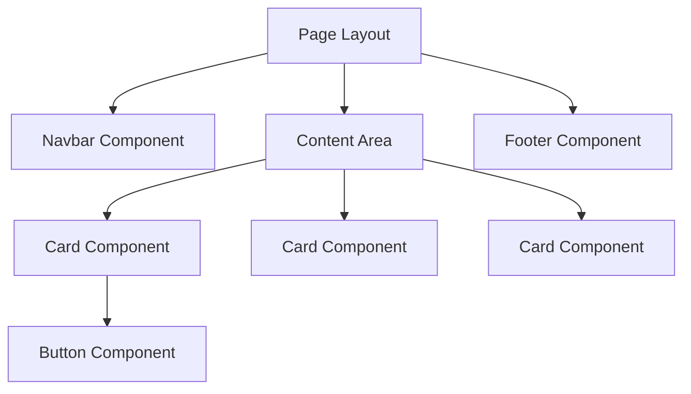

# 6.2 Blade Components (คอมโพเนนต์)

> **บทนี้คุณจะได้เรียนรู้**
> - แนวคิด Component-based UI
> - Anonymous Components (ไม่มี Class)
> - Class-based Components
> - Slots และ Attributes

---

## วัตถุประสงค์การเรียนรู้

เมื่อจบบทเรียนนี้ ผู้เรียนจะสามารถ:
1. อธิบายแนวคิดของ Component-based UI ได้
2. สร้าง Anonymous Components สำหรับ UI ที่ใช้ซ้ำได้
3. สร้าง Class-based Components ที่มี Logic ได้
4. ใช้ Slots และ Attributes ส่งข้อมูลเข้า Component ได้

---

## เนื้อหา

### 1. แนวคิด Component-based UI

**Components** คือชิ้นส่วน UI ที่ Reusable ได้ เปรียบเสมือน **"ชิ้นส่วน LEGO"** ที่ประกอบกันเป็นหน้าเว็บ



| ประเภท | สร้างด้วย | เหมาะกับ |
|--------|---------|---------|
| **Anonymous** | ไฟล์ Blade อย่างเดียว | UI ง่ายๆ เช่น Button, Card, Alert |
| **Class-based** | Class + ไฟล์ Blade | UI ที่มี Logic เช่น Dropdown, Modal |

### 2. Anonymous Components

สร้างไฟล์ใน `resources/views/components/`:

```blade
{{-- resources/views/components/alert.blade.php --}}
@props(['type' => 'info', 'message'])

<div class="alert alert-{{ $type }}">
    {{ $message }}
</div>
```

```blade
{{-- การใช้งาน --}}
<x-alert type="success" message="บันทึกข้อมูลเรียบร้อย" />
<x-alert type="error" message="เกิดข้อผิดพลาด" />
<x-alert message="ข้อมูลทั่วไป" /> {{-- ใช้ค่า default: info --}}
```

### 3. Class-based Components

```bash
php artisan make:component Card
```

```php
// app/View/Components/Card.php
class Card extends Component
{
    public function __construct(
        public string $title,
        public string $description = '',
        public string $image = '',
    ) {}

    public function render()
    {
        return view('components.card');
    }
}
```

```blade
{{-- resources/views/components/card.blade.php --}}
<div {{ $attributes->merge(['class' => 'card']) }}>
    @if($image)
        
    @endif
    <h3>{{ $title }}</h3>
    <p>{{ $description }}</p>
    {{ $slot }}
</div>
```

```blade
{{-- การใช้งาน --}}
<x-card title="สินค้า A" description="รายละเอียด" image="/img/a.jpg">
    <button>เพิ่มลงตะกร้า</button>
</x-card>
```

### 4. Slots

**Slots** คือช่องว่างใน Component ที่ให้ผู้ใช้ใส่เนื้อหาเข้าไปได้:

```blade
{{-- resources/views/components/modal.blade.php --}}
<div class="modal">
    <div class="modal-header">
        {{ $title }}
    </div>
    <div class="modal-body">
        {{ $slot }} {{-- Default Slot --}}
    </div>
    <div class="modal-footer">
        {{ $footer }}
    </div>
</div>
```

```blade
{{-- การใช้งาน --}}
<x-modal>
    <x-slot:title>ยืนยันการลบ</x-slot:title>

    <p>คุณต้องการลบข้อมูลนี้หรือไม่?</p>

    <x-slot:footer>
        <button>ยกเลิก</button>
        <button>ยืนยัน</button>
    </x-slot:footer>
</x-modal>
```

---

### การใช้ AI ช่วยพัฒนา

#### Prompt ตัวอย่าง:

```
สร้าง Blade Component สำหรับ Alert Box ที่:
- รับ type (success, error, warning, info)
- รับ message
- มีปุ่มปิด (dismiss)
- ใช้ TailwindCSS
```

#### การ Review Code จาก AI

เมื่อได้โค้ดจาก AI ให้ตรวจสอบ:
- [ ] ใช้ `@props` กำหนดค่า default ถูกต้องหรือไม่
- [ ] ใช้ `$attributes->merge()` สำหรับ class ที่ยืดหยุ่นหรือไม่
- [ ] ข้อมูลจากผู้ใช้ใช้ `{{ }}` (escaped) หรือไม่

---

## แบบฝึกหัด

### Exercise 1: สร้าง Button Component

**โจทย์:** สร้าง Anonymous Component `<x-button>` ที่:
1. รับ `type` (primary, secondary, danger) มีค่า default เป็น primary
2. รับ `size` (sm, md, lg) มีค่า default เป็น md
3. แสดงข้อความผ่าน slot

<details>
<summary>ดูเฉลย</summary>

```blade
{{-- resources/views/components/button.blade.php --}}
@props(['type' => 'primary', 'size' => 'md'])

<button {{ $attributes->merge(['class' => "btn btn-{$type} btn-{$size}"]) }}>
    {{ $slot }}
</button>
```

```blade
{{-- การใช้งาน --}}
<x-button>บันทึก</x-button>
<x-button type="danger" size="sm">ลบ</x-button>
<x-button type="secondary" onclick="history.back()">ย้อนกลับ</x-button>
```

</details>

---

## สรุป

| หัวข้อ | สิ่งที่ได้เรียนรู้ |
|--------|-------------------|
| Anonymous Components | สร้างจากไฟล์ Blade อย่างเดียว ใช้ `@props` |
| Class-based Components | มี PHP Class + Blade, เหมาะกับ UI ที่มี Logic |
| Slots | ช่องว่างให้ใส่เนื้อหา ใช้ `{{ $slot }}` และ `<x-slot:name>` |
| Attributes | ใช้ `$attributes->merge()` สำหรับ class ที่ยืดหยุ่น |

---

**Navigation:**
[⬅️ ก่อนหน้า](01-blade-basics.md) | [📚 สารบัญ](../../README.md) | [➡️ ถัดไป](03-layouts.md)
