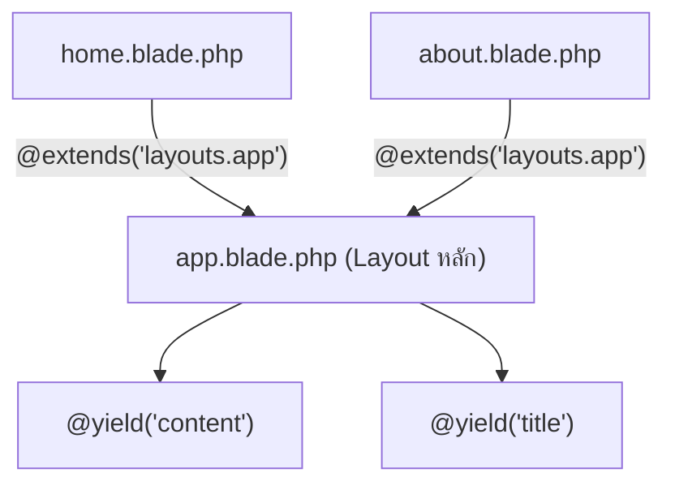

# 6.3 Layouts (การจัดโครงสร้างหน้าเว็บ)

> **บทนี้คุณจะได้เรียนรู้**
> - Template Inheritance ด้วย @extends และ @section
> - Component Layouts ด้วย <x-layout>
> - การใช้ @include สำหรับ Partial Views
> - การจัดการ Navigation และ Active State

---

## วัตถุประสงค์การเรียนรู้

เมื่อจบบทเรียนนี้ ผู้เรียนจะสามารถ:
1. สร้าง Layout หลักสำหรับเว็บไซต์ได้
2. ใช้ Template Inheritance แบ่งโครงสร้างหน้าเว็บได้
3. ใช้ @include แยกส่วน UI ที่ใช้ซ้ำได้
4. จัดการ Active State ของ Navigation ได้

---

## เนื้อหา

### 1. Template Inheritance (@extends / @section)

**Template Inheritance** คือการสร้าง Layout หลัก แล้วให้หน้าย่อยสืบทอดโครงสร้างมา เปรียบเสมือน **"กรอบรูป"** ที่เปลี่ยนได้เฉพาะรูปข้างใน



#### สร้าง Layout หลัก

```blade
{{-- resources/views/layouts/app.blade.php --}}
<!DOCTYPE html>
<html lang="th">
<head>
    <meta charset="UTF-8">
    <title>@yield('title', 'My App')</title>
    @vite(['resources/css/app.css', 'resources/js/app.js'])
    @stack('styles')
</head>
<body>
    @include('partials.navbar')

    <main class="container">
        @yield('content')
    </main>

    @include('partials.footer')
    @stack('scripts')
</body>
</html>
```

#### สร้างหน้าย่อย

```blade
{{-- resources/views/home.blade.php --}}
@extends('layouts.app')

@section('title', 'หน้าแรก')

@section('content')
    <h1>ยินดีต้อนรับ</h1>
    <p>นี่คือหน้าแรกของเว็บไซต์</p>
@endsection

@push('scripts')
    <script>console.log('Home page loaded');</script>
@endpush
```

| Directive | หน้าที่ |
|-----------|--------|
| `@yield('name')` | กำหนดจุดที่หน้าย่อยจะใส่เนื้อหา |
| `@extends('layout')` | สืบทอด Layout |
| `@section('name')` | กำหนดเนื้อหาสำหรับ yield |
| `@stack('name')` | จุดสำหรับ push CSS/JS |
| `@push('name')` | เพิ่ม CSS/JS เข้า stack |

### 2. Component Layouts

วิธีใหม่ที่แนะนำใน Laravel เวอร์ชันล่าสุด:

```blade
{{-- resources/views/components/layout.blade.php --}}
<!DOCTYPE html>
<html lang="th">
<head>
    <title>{{ $title ?? 'My App' }}</title>
    @vite(['resources/css/app.css', 'resources/js/app.js'])
</head>
<body>
    <x-navbar />
    <main>{{ $slot }}</main>
    <x-footer />
</body>
</html>
```

```blade
{{-- resources/views/home.blade.php --}}
<x-layout title="หน้าแรก">
    <h1>ยินดีต้อนรับ</h1>
    <p>นี่คือหน้าแรกของเว็บไซต์</p>
</x-layout>
```

### 3. Partial Views (@include)

แยกส่วน UI ที่ใช้ซ้ำออกเป็นไฟล์ย่อย:

```blade
{{-- resources/views/partials/navbar.blade.php --}}
<nav>
    <a href="{{ route('home') }}"
       class="{{ request()->routeIs('home') ? 'active' : '' }}">
        หน้าแรก
    </a>
    <a href="{{ route('products.index') }}"
       class="{{ request()->routeIs('products.*') ? 'active' : '' }}">
        สินค้า
    </a>
</nav>
```

```blade
{{-- ใช้งานใน Layout --}}
@include('partials.navbar')

{{-- ส่งข้อมูลเข้า partial --}}
@include('partials.product-card', ['product' => $product])
```

---

### การใช้ AI ช่วยพัฒนา

#### Prompt ตัวอย่าง:

```
สร้าง Blade Layout สำหรับเว็บไซต์ที่มี:
- Navbar พร้อม Active State
- Sidebar (แสดงเฉพาะบางหน้า)
- Content Area
- Footer
- ใช้ TailwindCSS
```

---

## แบบฝึกหัด

### Exercise 1: สร้าง Layout

**โจทย์:** สร้าง Layout หลักและหน้าย่อย 2 หน้า:
1. Layout มี Navbar, Content, Footer
2. หน้า Home แสดง "ยินดีต้อนรับ"
3. หน้า About แสดง "เกี่ยวกับเรา"

<details>
<summary>ดูเฉลย</summary>

```blade
{{-- layouts/app.blade.php --}}
<!DOCTYPE html>
<html>
<head><title>@yield('title')</title></head>
<body>
    <nav>
        <a href="/">Home</a> | <a href="/about">About</a>
    </nav>
    <main>@yield('content')</main>
    <footer>© 2024</footer>
</body>
</html>

{{-- home.blade.php --}}
@extends('layouts.app')
@section('title', 'หน้าแรก')
@section('content')
    <h1>ยินดีต้อนรับ</h1>
@endsection

{{-- about.blade.php --}}
@extends('layouts.app')
@section('title', 'เกี่ยวกับเรา')
@section('content')
    <h1>เกี่ยวกับเรา</h1>
@endsection
```

</details>

---

## สรุป

| หัวข้อ | สิ่งที่ได้เรียนรู้ |
|--------|-------------------|
| Template Inheritance | `@extends`, `@yield`, `@section` |
| Component Layouts | `<x-layout>` แบบใหม่ ใช้ Slots |
| Partial Views | `@include` แยกส่วน UI ที่ใช้ซ้ำ |
| Stacks | `@stack` / `@push` สำหรับ CSS/JS |

---

**Navigation:**
[⬅️ ก่อนหน้า](02-components.md) | [📚 สารบัญ](../../README.md) | [➡️ ถัดไป](04-directives.md)
