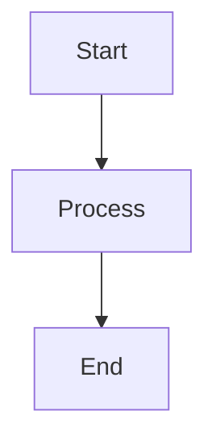

# Frontend Assets

> 📖 **บทนี้คุณจะได้เรียนรู้**
> - หัวข้อหลักที่ 1
> - หัวข้อหลักที่ 2
> - หัวข้อหลักที่ 3

## 🎯 วัตถุประสงค์

<!-- อธิบายว่าทำไมต้องเรียนหัวข้อนี้ -->

## 📚 เนื้อหา

### Frontend Assets Concept

<!-- อธิบายแนวคิด -->

#### 💡 ตัวอย่างโค้ด

```php
// โค้ดตัวอย่างที่อธิบายได้ชัดเจน
// มี comment ภาษาไทย
```

#### 📊 Diagram/Flowchart (ถ้ามี)



#### ⚠️ ข้อควรระวัง

<!-- สิ่งที่ต้องระวังหรือ common mistakes -->

#### 💪 Best Practices

<!-- แนวทางปฏิบัติที่ดี -->

### 🤖 การใช้ AI ช่วยพัฒนา

<!-- แสดงวิธีใช้ AI สำหรับหัวข้อนี้ -->

#### Prompt ตัวอย่าง:

```
[Prompt ที่ใช้กับ AI]
```

#### ผลลัพธ์:

```php
// โค้ดที่ AI generate
```

#### 🔍 การ Review Code จาก AI

<!-- วิธีตรวจสอบและปรับปรุง AI-generated code -->

## 🎓 แบบฝึกหัด

### Exercise 1: [ชื่อแบบฝึกหัด]

**โจทย์:**
<!-- คำอธิบายโจทย์ -->

**เป้าหมาย:**
<!-- สิ่งที่ต้องทำให้สำเร็จ -->

**Hints:**
<!-- คำแนะนำ -->

<details>
<summary>💡 ดูเฉลย</summary>

```php
// โค้ดเฉลย
```

**คำอธิบาย:**
<!-- อธิบายเฉลย -->

</details>

## 🔗 Resources เพิ่มเติม

- [ลิงก์ไปยัง Laravel Docs](https://laravel.com/docs)

## 📌 สรุป

<!-- สรุปประเด็นสำคัญของบทนี้ -->

## ⏭️ บทถัดไป

- [ชื่อบทถัดไป](#)

---

**Navigation:**
[⬅️ ก่อนหน้า](#) | [📚 สารบัญ](../../README.md) | [➡️ ถัดไป](#)
