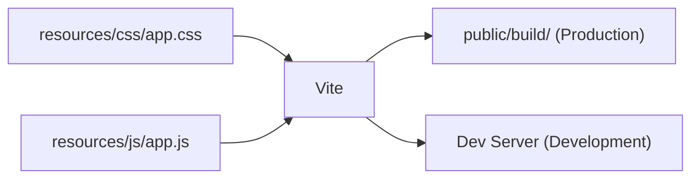

# 6.5 Frontend Assets (การจัดการ CSS/JS)

> **บทนี้คุณจะได้เรียนรู้**
> - Vite ใน Laravel
> - การใช้ TailwindCSS
> - การจัดการ JavaScript
> - Asset Helpers (@vite, asset())

---

## วัตถุประสงค์การเรียนรู้

เมื่อจบบทเรียนนี้ ผู้เรียนจะสามารถ:
1. ใช้ Vite จัดการ Frontend Assets ใน Laravel ได้
2. ตั้งค่าและใช้งาน TailwindCSS ได้
3. จัดการไฟล์ JavaScript และ CSS ได้อย่างเป็นระบบ
4. ใช้ Asset Helpers ใน Blade ได้

---

## เนื้อหา

### 1. Vite ใน Laravel

**Vite** คือ Build Tool สำหรับ Frontend ที่ Laravel ใช้เป็นค่าเริ่มต้น เปรียบเสมือน **"โรงงานแปลงวัตถุดิบ"** ที่แปลง CSS/JS ให้พร้อมใช้งาน



```bash
# ติดตั้ง Dependencies
npm install

# รัน Dev Server (Hot Reload)
npm run dev

# Build สำหรับ Production
npm run build
```

### 2. การใช้ @vite ใน Blade

```blade
<!DOCTYPE html>
<html>
<head>
    {{-- โหลด CSS และ JS ผ่าน Vite --}}
    @vite(['resources/css/app.css', 'resources/js/app.js'])
</head>
<body>
    {{ $slot }}
</body>
</html>
```

### 3. TailwindCSS

Laravel มาพร้อม TailwindCSS เป็นค่าเริ่มต้น:

```css
/* resources/css/app.css */
@tailwind base;
@tailwind components;
@tailwind utilities;
```

```blade
{{-- ใช้ TailwindCSS ใน Blade --}}
<div class="container mx-auto p-4">
    <h1 class="text-2xl font-bold text-gray-800">สินค้า</h1>

    <div class="grid grid-cols-3 gap-4 mt-4">
        @foreach($products as $product)
            <div class="bg-white rounded-lg shadow p-4">
                <h3 class="font-semibold">{{ $product->name }}</h3>
                <p class="text-green-600">{{ number_format($product->price) }} บาท</p>
                <button class="mt-2 bg-blue-500 text-white px-4 py-2 rounded hover:bg-blue-600">
                    เพิ่มลงตะกร้า
                </button>
            </div>
        @endforeach
    </div>
</div>
```

### 4. Asset Helpers

| Helper | ใช้สำหรับ | ตัวอย่าง |
|--------|---------|---------|
| `@vite()` | โหลด CSS/JS ผ่าน Vite | `@vite(['resources/css/app.css'])` |
| `asset()` | ไฟล์ใน public/ | `asset('images/logo.png')` |
| `url()` | สร้าง URL เต็ม | `url('/about')` |

```blade
{{-- รูปภาพจาก public/images/ --}}


{{-- ไฟล์ที่อัปโหลดใน storage --}}
image) }}" alt="{{ $product->name }}">
```

### 5. การจัดการ JavaScript

```javascript
// resources/js/app.js
import './bootstrap';

// Import Alpine.js (ถ้าใช้)
import Alpine from 'alpinejs';
window.Alpine = Alpine;
Alpine.start();
```

```blade
{{-- ใช้ Alpine.js สำหรับ Interactivity --}}
<div x-data="{ open: false }">
    <button @click="open = !open" class="btn">
        เมนู
    </button>
    <div x-show="open" class="dropdown">
        <a href="#">โปรไฟล์</a>
        <a href="#">ตั้งค่า</a>
    </div>
</div>
```

---

### การใช้ AI ช่วยพัฒนา

#### Prompt ตัวอย่าง:

```
สร้างหน้า Product Listing ด้วย TailwindCSS ที่มี:
- Responsive Grid (1 คอลัมน์บนมือถือ, 3 คอลัมน์บน Desktop)
- Card มีรูป, ชื่อ, ราคา, ปุ่ม
- Dark Mode Support
```

---

## แบบฝึกหัด

### Exercise 1: สร้างหน้า Landing Page

**โจทย์:** สร้างหน้า Landing Page ด้วย TailwindCSS ที่มี:
1. Hero Section พร้อมข้อความและปุ่ม CTA
2. Feature Section แสดง 3 คุณสมบัติเป็น Card
3. Responsive (มือถือ 1 คอลัมน์, Desktop 3 คอลัมน์)

<details>
<summary>ดูเฉลย</summary>

```blade
<x-layout title="หน้าแรก">
    {{-- Hero --}}
    <section class="bg-blue-600 text-white py-20 text-center">
        <h1 class="text-4xl font-bold">ยินดีต้อนรับ</h1>
        <p class="mt-4 text-lg">ระบบจัดการข้อมูลที่ดีที่สุด</p>
        <a href="{{ route('register') }}"
           class="mt-6 inline-block bg-white text-blue-600 px-6 py-3 rounded-lg font-semibold">
            เริ่มต้นใช้งาน
        </a>
    </section>

    {{-- Features --}}
    <section class="container mx-auto py-16 px-4">
        <div class="grid grid-cols-1 md:grid-cols-3 gap-8">
            <div class="bg-white p-6 rounded-lg shadow text-center">
                <h3 class="text-xl font-bold">ง่าย</h3>
                <p class="mt-2 text-gray-600">ใช้งานง่าย ไม่ซับซ้อน</p>
            </div>
            <div class="bg-white p-6 rounded-lg shadow text-center">
                <h3 class="text-xl font-bold">เร็ว</h3>
                <p class="mt-2 text-gray-600">ประมวลผลรวดเร็ว</p>
            </div>
            <div class="bg-white p-6 rounded-lg shadow text-center">
                <h3 class="text-xl font-bold">ปลอดภัย</h3>
                <p class="mt-2 text-gray-600">รักษาความปลอดภัยข้อมูล</p>
            </div>
        </div>
    </section>
</x-layout>
```

</details>

---

## สรุป

| หัวข้อ | สิ่งที่ได้เรียนรู้ |
|--------|-------------------|
| Vite | Build Tool สำหรับ CSS/JS, `npm run dev` / `npm run build` |
| TailwindCSS | Utility-first CSS Framework |
| Asset Helpers | `@vite()`, `asset()`, `Storage::url()` |
| Alpine.js | Lightweight JS สำหรับ Interactivity |

---

**Navigation:**
[⬅️ ก่อนหน้า](04-directives.md) | [📚 สารบัญ](../../README.md) | [➡️ ถัดไป](../07-forms-validation/01-form-handling.md)
