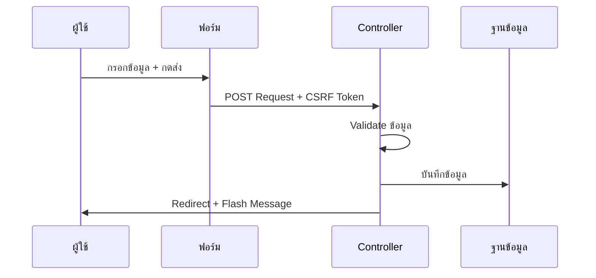

# 7.1 Form Handling (การจัดการฟอร์ม)

> **บทนี้คุณจะได้เรียนรู้**
> - การสร้างฟอร์มใน Laravel
> - การรับข้อมูลจากฟอร์มด้วย Request
> - CSRF Protection
> - Flash Messages และ Redirect

---

## วัตถุประสงค์การเรียนรู้

เมื่อจบบทเรียนนี้ ผู้เรียนจะสามารถ:
1. สร้างฟอร์ม HTML ที่ทำงานร่วมกับ Laravel ได้
2. รับและจัดการข้อมูลจากฟอร์มใน Controller ได้
3. ใช้ CSRF Protection ป้องกันการโจมตีได้
4. ส่ง Flash Messages และ Redirect หลังจากบันทึกข้อมูลได้

---

## เนื้อหา

### 1. การสร้างฟอร์มใน Laravel



```blade
<form action="{{ route('products.store') }}" method="POST" enctype="multipart/form-data">
    @csrf

    <div>
        <label for="name">ชื่อสินค้า</label>
        <input type="text" id="name" name="name" value="{{ old('name') }}">
        @error('name')
            <span class="text-red-500">{{ $message }}</span>
        @enderror
    </div>

    <div>
        <label for="price">ราคา</label>
        <input type="number" id="price" name="price" value="{{ old('price') }}" step="0.01">
    </div>

    <div>
        <label for="image">รูปภาพ</label>
        <input type="file" id="image" name="image" accept="image/*">
    </div>

    <button type="submit">บันทึก</button>
</form>
```

### 2. การรับข้อมูลใน Controller

```php
use Illuminate\Http\Request;

public function store(Request $request)
{
    // รับข้อมูลทั้งหมด
    $allData = $request->all();

    // รับเฉพาะ field ที่ต้องการ
    $data = $request->only(['name', 'price', 'description']);

    // รับทุก field ยกเว้นที่ระบุ
    $data = $request->except(['_token']);

    // รับค่าเดี่ยว
    $name = $request->input('name');
    $name = $request->name; // shorthand

    // ค่า default ถ้าไม่มี
    $page = $request->input('page', 1);

    // ตรวจสอบว่ามี field หรือไม่
    if ($request->has('discount')) {
        // มี field discount
    }
}
```

| Method | หน้าที่ |
|--------|--------|
| `$request->all()` | รับข้อมูลทั้งหมด |
| `$request->only([...])` | รับเฉพาะ field ที่ระบุ |
| `$request->except([...])` | รับทุก field ยกเว้นที่ระบุ |
| `$request->input('name')` | รับค่าเดี่ยว |
| `$request->has('field')` | ตรวจสอบว่ามี field หรือไม่ |
| `$request->file('image')` | รับไฟล์ที่อัปโหลด |

### 3. การอัปโหลดไฟล์

```php
public function store(Request $request)
{
    if ($request->hasFile('image')) {
        // เก็บไฟล์ใน storage/app/public/products
        $path = $request->file('image')->store('products', 'public');

        Product::create([
            'name' => $request->name,
            'image' => $path,
        ]);
    }
}
```

### 4. Flash Messages และ Redirect

```php
// Redirect พร้อม Flash Message
return redirect()->route('products.index')
    ->with('success', 'บันทึกสินค้าเรียบร้อยแล้ว');

// Redirect กลับหน้าเดิม
return back()->with('error', 'เกิดข้อผิดพลาด');

// Redirect กลับพร้อมข้อมูลเดิม (เมื่อ Validation ไม่ผ่าน)
return back()->withInput()->withErrors($validator);
```

```blade
{{-- แสดง Flash Message ใน Blade --}}
@if(session('success'))
    <div class="alert alert-success">{{ session('success') }}</div>
@endif

@if(session('error'))
    <div class="alert alert-danger">{{ session('error') }}</div>
@endif
```

---

### การใช้ AI ช่วยพัฒนา

#### Prompt ตัวอย่าง:

```
สร้าง Controller method สำหรับจัดการฟอร์มสมัครสมาชิกที่มี:
- ชื่อ, อีเมล, รหัสผ่าน, รูปโปรไฟล์
- Validate ข้อมูล
- อัปโหลดรูปภาพ
- Redirect พร้อม Flash Message
```

---

## แบบฝึกหัด

### Exercise 1: สร้างฟอร์มเพิ่มสินค้า

**โจทย์:** สร้างฟอร์มและ Controller สำหรับเพิ่มสินค้าที่มี: ชื่อ, ราคา, รายละเอียด, รูปภาพ

<details>
<summary>ดูเฉลย</summary>

```php
// ProductController.php
public function create()
{
    return view('products.create');
}

public function store(Request $request)
{
    $validated = $request->validate([
        'name' => 'required|max:255',
        'price' => 'required|numeric|min:0',
        'description' => 'nullable',
        'image' => 'nullable|image|max:2048',
    ]);

    if ($request->hasFile('image')) {
        $validated['image'] = $request->file('image')->store('products', 'public');
    }

    Product::create($validated);

    return redirect()->route('products.index')
        ->with('success', 'เพิ่มสินค้าเรียบร้อยแล้ว');
}
```

</details>

---

## สรุป

| หัวข้อ | สิ่งที่ได้เรียนรู้ |
|--------|-------------------|
| สร้างฟอร์ม | `@csrf`, `method="POST"`, `enctype` สำหรับไฟล์ |
| รับข้อมูล | `$request->all()`, `only()`, `input()`, `file()` |
| อัปโหลดไฟล์ | `store()` เก็บใน Storage |
| Redirect | `redirect()->route()`, `back()`, `with()` |

---

**Navigation:**
[⬅️ ก่อนหน้า](../06-views-blade/05-frontend-assets.md) | [📚 สารบัญ](../../README.md) | [➡️ ถัดไป](02-validation.md)
