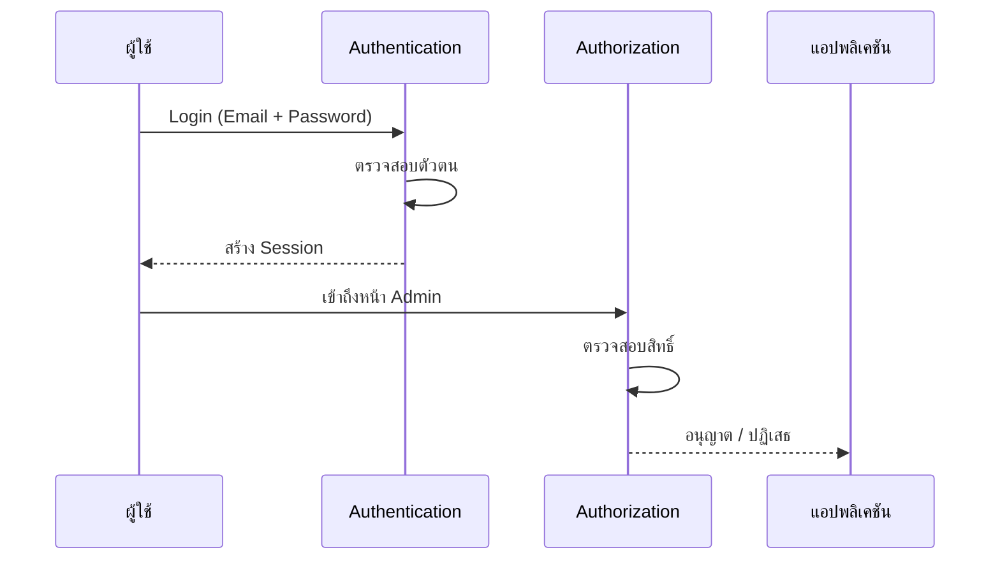

# 8.1 Authentication Introduction (พื้นฐานระบบยืนยันตัวตน)

> **บทนี้คุณจะได้เรียนรู้**
> - แนวคิด Authentication vs Authorization
> - ระบบ Authentication ใน Laravel
> - Laravel Breeze / Fortify / Jetstream
> - Session-based vs Token-based Authentication

---

## วัตถุประสงค์การเรียนรู้

เมื่อจบบทเรียนนี้ ผู้เรียนจะสามารถ:
1. อธิบายความแตกต่างระหว่าง Authentication กับ Authorization ได้
2. เข้าใจโครงสร้างระบบ Authentication ของ Laravel ได้
3. เลือก Authentication Package ที่เหมาะสมกับโปรเจกต์ได้
4. อธิบาย Flow การ Login/Logout ได้

---

## เนื้อหา

### 1. Authentication vs Authorization

| แนวคิด | Authentication (AuthN) | Authorization (AuthZ) |
|--------|----------------------|---------------------|
| **คำถาม** | "คุณคือใคร?" | "คุณมีสิทธิ์ทำอะไร?" |
| **ตัวอย่าง** | Login ด้วย Email + Password | Admin เข้าหน้า Dashboard ได้ |
| **เปรียบเทียบ** | แสดงบัตรประชาชน | ตรวจสอบว่ามีสิทธิ์เข้าห้องหรือไม่ |
| **ใน Laravel** | `Auth::attempt()` | `Gate`, `Policy` |



### 2. Authentication Packages ใน Laravel

| Package | ความซับซ้อน | เหมาะกับ | มีอะไรบ้าง |
|---------|-----------|---------|-----------|
| **Breeze** | ง่าย | เริ่มต้น, โปรเจกต์เล็ก | Login, Register, Reset Password |
| **Fortify** | ปานกลาง | Backend-only Auth | ไม่มี UI, ใช้กับ SPA |
| **Jetstream** | ซับซ้อน | โปรเจกต์ใหญ่ | 2FA, Teams, API Tokens |
| **Sanctum** | ปานกลาง | API Authentication | Token-based, SPA Auth |

### 3. การติดตั้ง Laravel Breeze

```bash
# ติดตั้ง Breeze
composer require laravel/breeze --dev

# สร้างไฟล์ Auth (เลือก Blade)
php artisan breeze:install blade

# ติดตั้ง Frontend Dependencies
npm install && npm run build

# รัน Migration
php artisan migrate
```

Breeze จะสร้างให้:
- หน้า Login, Register, Forgot Password
- Controller สำหรับ Auth
- Middleware `auth` สำหรับป้องกันหน้าที่ต้อง Login

### 4. Auth Helpers ที่ใช้บ่อย

```php
// ตรวจสอบว่า Login แล้วหรือไม่
if (Auth::check()) {
    // Login แล้ว
}

// ดึงข้อมูลผู้ใช้ปัจจุบัน
$user = Auth::user();
$user = auth()->user();

// ดึง ID ผู้ใช้
$id = Auth::id();

// Logout
Auth::logout();
```

| Helper | หน้าที่ |
|--------|--------|
| `Auth::check()` | ตรวจสอบว่า Login แล้วหรือไม่ |
| `Auth::user()` | ดึงข้อมูลผู้ใช้ปัจจุบัน |
| `Auth::id()` | ดึง ID ผู้ใช้ |
| `Auth::attempt($credentials)` | พยายาม Login |
| `Auth::logout()` | Logout |
| `auth()->user()` | Shorthand ดึงผู้ใช้ |

---

### การใช้ AI ช่วยพัฒนา

#### Prompt ตัวอย่าง:

```
อธิบายความแตกต่างระหว่าง Laravel Breeze, Fortify, Jetstream
และ Sanctum พร้อมแนะนำว่าควรเลือกใช้อันไหนสำหรับ
ระบบจัดการนักศึกษาของมหาวิทยาลัย
```

---

## แบบฝึกหัด

### Exercise 1: ติดตั้ง Authentication

**โจทย์:** ติดตั้ง Laravel Breeze และทดสอบระบบ Login/Register

<details>
<summary>ดูเฉลย</summary>

```bash
composer require laravel/breeze --dev
php artisan breeze:install blade
npm install && npm run build
php artisan migrate
php artisan serve
```

ทดสอบ:
1. เปิด `http://localhost:8000/register` สมัครสมาชิก
2. เปิด `http://localhost:8000/login` เข้าสู่ระบบ
3. เปิด `http://localhost:8000/dashboard` ดูหน้า Dashboard

</details>

---

## สรุป

| หัวข้อ | สิ่งที่ได้เรียนรู้ |
|--------|-------------------|
| Authentication | ยืนยันตัวตน "คุณคือใคร?" |
| Authorization | ตรวจสอบสิทธิ์ "คุณทำอะไรได้?" |
| Breeze | Package สำหรับ Auth เริ่มต้น |
| Auth Helpers | `Auth::check()`, `Auth::user()`, `Auth::logout()` |

---

**Navigation:**
[⬅️ ก่อนหน้า](../07-forms-validation/02-validation.md) | [📚 สารบัญ](../../README.md) | [➡️ ถัดไป](02-implementing-auth.md)
