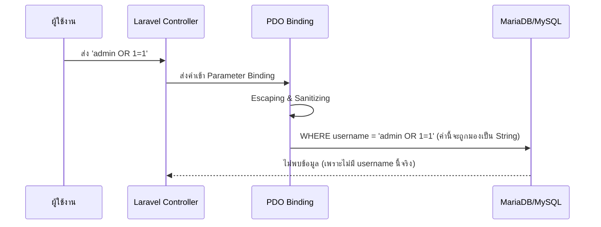

# 9.1 SQL Injection Prevention

> 📖 **บทนี้คุณจะได้เรียนรู้**
> - SQL Injection คืออะไรและร้ายแรงแค่ไหน
> - วิธีที่ Laravel ป้องกัน SQL Injection โดยอัตโนมัติ
> - วิธีใช้งาน Raw Query อย่างไรให้ปลอดภัย

---

## 🎯 วัตถุประสงค์

เพื่อให้มั่นใจว่าระบบฐานข้อมูลขององค์กรจะไม่ถูกลักลอบขโมยข้อมูลหรือลบข้อมูลผ่านการโจมตีแบบ SQL Injection

## 📚 เนื้อหา

### SQL Injection คืออะไร?

คือการที่ผู้โจมตีแอบใส่คำสั่ง SQL ลงไปใน Input ของแอปพลิเคชัน เพื่อให้ฐานข้อมูลรันคำสั่งที่ผิดไปจากเดิม เช่น:
- ใส่ `' OR '1'='1` ในช่อง Password เพื่อ Bypass การ Login
- ใส่ `; DROP TABLE users;` เพื่อลบข้อมูล

#### 🛡️ วิธีป้องกันใน Laravel

Laravel ใช้ **PDO Parameter Binding** ผ่าน Eloquent ORM และ Query Builder ซึ่งจะทำการ "Clean" ข้อมูลก่อนส่งไปที่ฐานข้อมูลเสมอ

#### 💡 ตัวอย่างโค้ดที่ปลอดภัย (Safe)

```php
// การใช้ Eloquent (ปลอดภัยที่สุด)
$user = User::where('email', $request->email)->first();

// การใช้ Query Builder (ปลอดภัย)
$user = DB::table('users')->where('email', $request->email)->first();
```

#### 💡 ตัวอย่างโค้ดที่อันตราย (Unsafe)

```diff
- // อย่าทำแบบนี้เด็ดขาด!
- $user = DB::select("SELECT * FROM users WHERE email = '" . $request->email . "'");

+ // ควรใช้แบบนี้
+ $user = DB::select("SELECT * FROM users WHERE email = ?", [$request->email]);
```

#### 📊 Flow: SQL Injection Protection



---

### 🤖 การใช้ AI ตรวจสอบความปลอดภัย

เราสามารถให้ AI ช่วย Review โค้ดของเราว่ามีช่องโหว่หรือไม่

#### Prompt ตัวอย่าง:
"Check this Laravel code for SQL Injection vulnerabilities: [Code Block]"

---

## 🎓 แบบฝึกหัด

### Exercise: ปรับปรุง Raw Query ให้ปลอดภัย

**โจทย์:** เปลี่ยนโค้ด Raw SQL ต่อไปนี้ให้เป็น Eloquent หรือใช้ Parameter Binding

```php
$results = DB::select("SELECT * FROM logs WHERE type = '" . $type . "' AND date = '" . $date . "'");
```

<details>
<summary>💡 ดูเฉลย</summary>

```php
// วิธีที่ 1: ใช้ Eloquent
$results = Log::where('type', $type)->where('date', $date)->get();

// วิธีที่ 2: ใช้ Parameter Binding
$results = DB::select("SELECT * FROM logs WHERE type = ? AND date = ?", [$type, $date]);
```

</details>

---

**Navigation:**
[⬅️ ก่อนหน้า](../08-authentication/04-multi-auth.md) | [📚 สารบัญ](../../README.md) | [➡️ ถัดไป](02-mass-assignment.md)
