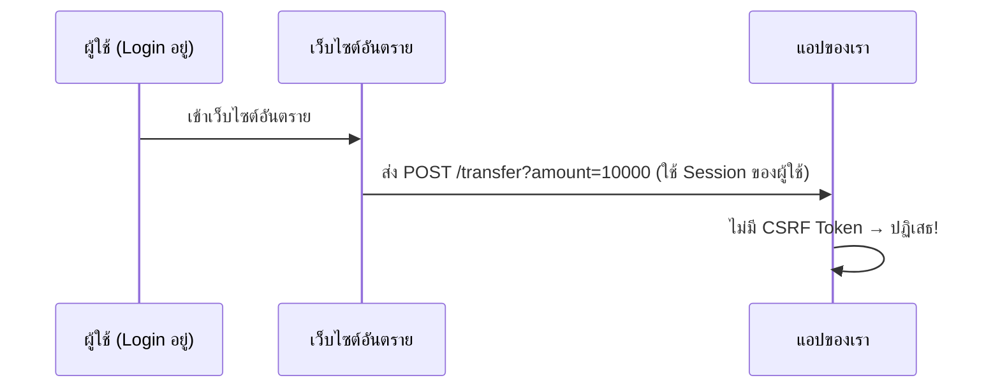

# 10.1 CSRF Protection (การป้องกัน CSRF)

> **บทนี้คุณจะได้เรียนรู้**
> - CSRF Attack คืออะไร
> - การป้องกันด้วย @csrf Token
> - CSRF กับ AJAX Requests
> - การยกเว้น CSRF สำหรับบาง Route

---

## วัตถุประสงค์การเรียนรู้

เมื่อจบบทเรียนนี้ ผู้เรียนจะสามารถ:
1. อธิบายการโจมตีแบบ CSRF ได้
2. ใช้ `@csrf` ป้องกันในทุกฟอร์มได้
3. ตั้งค่า CSRF Token สำหรับ AJAX Requests ได้

---

## เนื้อหา

### 1. CSRF Attack คืออะไร?

**CSRF (Cross-Site Request Forgery)** คือการโจมตีที่หลอกให้ผู้ใช้ที่ Login อยู่ส่ง Request ไปยังเว็บไซต์โดยไม่รู้ตัว



### 2. การป้องกันด้วย @csrf

```blade
{{-- ทุกฟอร์ม POST ต้องมี @csrf --}}
<form action="{{ route('products.store') }}" method="POST">
    @csrf
    <input type="text" name="name">
    <button type="submit">บันทึก</button>
</form>

{{-- @csrf จะสร้าง hidden input --}}
{{-- <input type="hidden" name="_token" value="random_token_here"> --}}
```

### 3. CSRF กับ AJAX

```blade
{{-- เพิ่ม Meta Tag ใน Layout --}}
<meta name="csrf-token" content="{{ csrf_token() }}">
```

```javascript
// ตั้งค่า Axios (มาพร้อม Laravel)
axios.defaults.headers.common['X-CSRF-TOKEN'] =
    document.querySelector('meta[name="csrf-token"]').content;

// หรือใช้ Fetch
fetch('/api/products', {
    method: 'POST',
    headers: {
        'X-CSRF-TOKEN': document.querySelector('meta[name="csrf-token"]').content,
        'Content-Type': 'application/json',
    },
    body: JSON.stringify({ name: 'สินค้าใหม่' }),
});
```

### 4. การยกเว้น CSRF

```php
// bootstrap/app.php (Laravel 11+)
->withMiddleware(function (Middleware $middleware) {
    $middleware->validateCsrfTokens(except: [
        'webhook/*',    // Webhook จากภายนอก
        'api/payment',  // Payment Gateway Callback
    ]);
})
```

---

## สรุป

| หัวข้อ | สิ่งที่ได้เรียนรู้ |
|--------|-------------------|
| CSRF Attack | หลอกให้ผู้ใช้ส่ง Request โดยไม่รู้ตัว |
| @csrf | ใส่ในทุกฟอร์ม POST/PUT/PATCH/DELETE |
| AJAX | ใช้ Meta Tag + X-CSRF-TOKEN Header |
| ยกเว้น | `validateCsrfTokens(except: [...])` |

---

**Navigation:**
[⬅️ ก่อนหน้า](../09-database-security/04-access-control.md) | [📚 สารบัญ](../../README.md) | [➡️ ถัดไป](02-xss-prevention.md)
