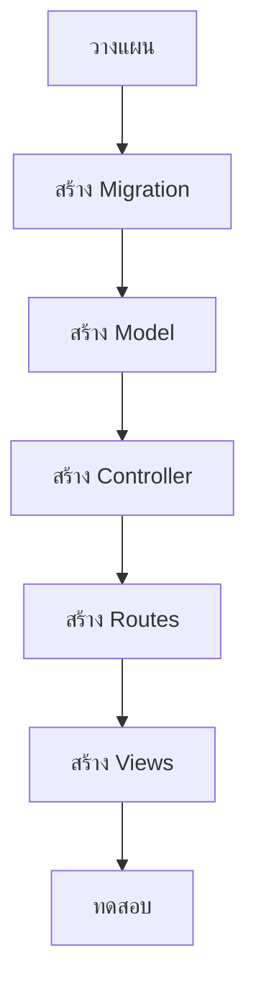

# 11.1 CRUD Planning (การวางแผนระบบ CRUD)

> **บทนี้คุณจะได้เรียนรู้**
> - การวางแผนระบบ CRUD
> - การออกแบบ Database Schema
> - Resource Controller และ Routes
> - โครงสร้างไฟล์ที่ต้องสร้าง

---

## วัตถุประสงค์การเรียนรู้

เมื่อจบบทเรียนนี้ ผู้เรียนจะสามารถ:
1. วางแผนระบบ CRUD ได้อย่างเป็นระบบ
2. ออกแบบ Database Schema ที่เหมาะสมได้
3. สร้าง Resource Controller และ Routes ได้
4. เข้าใจโครงสร้างไฟล์ทั้งหมดที่ต้องสร้าง

---

## เนื้อหา

### 1. CRUD คืออะไร?

| Operation | HTTP Method | Route | Controller Method | หน้าที่ |
|-----------|------------|-------|------------------|--------|
| **C**reate | GET/POST | /products/create, /products | create(), store() | สร้างข้อมูลใหม่ |
| **R**ead | GET | /products, /products/{id} | index(), show() | อ่านข้อมูล |
| **U**pdate | GET/PUT | /products/{id}/edit, /products/{id} | edit(), update() | แก้ไขข้อมูล |
| **D**elete | DELETE | /products/{id} | destroy() | ลบข้อมูล |

### 2. การวางแผน (ตัวอย่าง: ระบบจัดการสินค้า)



### 3. สร้างไฟล์ทั้งหมดด้วยคำสั่งเดียว

```bash
# สร้าง Model + Migration + Controller + Seeder + Factory
php artisan make:model Product -mcsf --resource

# หรือแยกสร้าง
php artisan make:model Product -m
php artisan make:controller ProductController --resource
```

### 4. Resource Routes

```php
// routes/web.php - สร้าง 7 Routes อัตโนมัติ
Route::resource('products', ProductController::class);
```

| Method | URI | Action | Route Name |
|--------|-----|--------|-----------|
| GET | /products | index | products.index |
| GET | /products/create | create | products.create |
| POST | /products | store | products.store |
| GET | /products/{product} | show | products.show |
| GET | /products/{product}/edit | edit | products.edit |
| PUT/PATCH | /products/{product} | update | products.update |
| DELETE | /products/{product} | destroy | products.destroy |

### 5. Migration ตัวอย่าง

```php
Schema::create('products', function (Blueprint $table) {
    $table->id();
    $table->string('name');
    $table->decimal('price', 10, 2);
    $table->text('description')->nullable();
    $table->string('image')->nullable();
    $table->foreignId('category_id')->constrained()->onDelete('cascade');
    $table->foreignId('user_id')->constrained()->onDelete('cascade');
    $table->boolean('is_active')->default(true);
    $table->timestamps();
});
```

---

## สรุป

| หัวข้อ | สิ่งที่ได้เรียนรู้ |
|--------|-------------------|
| CRUD | Create, Read, Update, Delete |
| Resource Controller | 7 Methods มาตรฐาน |
| Resource Routes | `Route::resource()` สร้าง 7 Routes |
| Artisan | `make:model -mcsf --resource` สร้างทุกอย่าง |

---

**Navigation:**
[⬅️ ก่อนหน้า](../10-application-security/04-api-security.md) | [📚 สารบัญ](../../README.md) | [➡️ ถัดไป](02-create.md)
