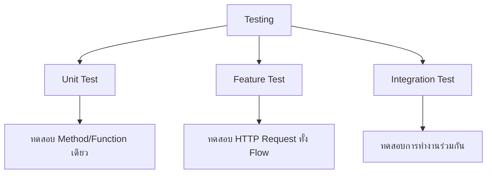

# 13.1 Testing Introduction (แนะนำการทดสอบ)

> **บทนี้คุณจะได้เรียนรู้**
> - ทำไมต้องเขียน Test
> - ประเภทของ Test (Unit, Feature, Integration)
> - PHPUnit และ Pest
> - การรัน Test ใน Laravel

---

## วัตถุประสงค์การเรียนรู้

เมื่อจบบทเรียนนี้ ผู้เรียนจะสามารถ:
1. อธิบายความสำคัญของการเขียน Test ได้
2. แยกประเภทของ Test ได้
3. รัน Test ด้วย Artisan Command ได้

---

## เนื้อหา

### 1. ทำไมต้องเขียน Test?

| เหตุผล | รายละเอียด |
|--------|-----------|
| **ป้องกัน Bug** | ตรวจจับ Bug ก่อน Deploy |
| **Refactor ได้มั่นใจ** | แก้โค้ดโดยไม่กลัวพัง |
| **เอกสารประกอบ** | Test อธิบายว่าโค้ดควรทำงานอย่างไร |
| **ประหยัดเวลา** | ลดเวลาทดสอบด้วยมือ |

### 2. ประเภทของ Test



| ประเภท | ทดสอบอะไร | ตัวอย่าง |
|--------|----------|---------|
| **Unit** | Method/Function เดียว | ทดสอบ `calculateTotal()` |
| **Feature** | HTTP Request ทั้ง Flow | ทดสอบ POST /products |
| **Integration** | การทำงานร่วมกัน | ทดสอบ Model + Database |

### 3. การรัน Test

```bash
# รัน Test ทั้งหมด
php artisan test

# รัน Test เฉพาะไฟล์
php artisan test --filter=ProductTest

# รัน Test พร้อมแสดงรายละเอียด
php artisan test --verbose

# รัน Test แบบหยุดเมื่อ Fail
php artisan test --stop-on-failure
```

### 4. โครงสร้างไฟล์ Test

```
tests/
├── Feature/          ← Feature Tests
│   └── ProductTest.php
├── Unit/             ← Unit Tests
│   └── ProductModelTest.php
├── TestCase.php      ← Base Test Class
└── CreatesApplication.php
```

---

## สรุป

| หัวข้อ | สิ่งที่ได้เรียนรู้ |
|--------|-------------------|
| Unit Test | ทดสอบ Method/Function เดียว |
| Feature Test | ทดสอบ HTTP Request ทั้ง Flow |
| `php artisan test` | รัน Test ทั้งหมด |
| `--filter` | รัน Test เฉพาะไฟล์/Method |

---

**Navigation:**
[⬅️ ก่อนหน้า](../12-reporting/04-realtime-reports.md) | [📚 สารบัญ](../../README.md) | [➡️ ถัดไป](02-writing-tests.md)
