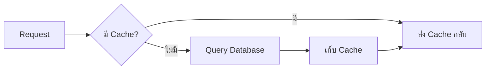

# 14.1 Caching (การแคชข้อมูล)

> **บทนี้คุณจะได้เรียนรู้**
> - Cache คืออะไรและทำไมต้องใช้
> - Cache Drivers (File, Redis, Database)
> - การใช้ Cache Facade
> - Cache Tags และ Cache Invalidation

---

## วัตถุประสงค์การเรียนรู้

เมื่อจบบทเรียนนี้ ผู้เรียนจะสามารถ:
1. อธิบายหลักการทำงานของ Cache ได้
2. ใช้ Cache Facade เก็บและดึงข้อมูลได้
3. จัดการ Cache Invalidation ได้

---

## เนื้อหา

### 1. Cache คืออะไร?

Cache คือการเก็บข้อมูลที่ใช้บ่อยไว้ในที่เข้าถึงเร็ว เพื่อลดการ Query ฐานข้อมูลซ้ำ



### 2. การใช้งาน Cache

```php
use Illuminate\Support\Facades\Cache;

// เก็บ Cache 60 นาที
Cache::put('products', Product::all(), now()->addMinutes(60));

// ดึง Cache
$products = Cache::get('products');

// ดึง Cache หรือ Query ถ้าไม่มี (แนะนำ)
$products = Cache::remember('products', now()->addMinutes(60), function () {
    return Product::with('category')->get();
});

// ลบ Cache
Cache::forget('products');

// ลบ Cache ทั้งหมด
Cache::flush();
```

### 3. ตัวอย่างการใช้งานจริง

```php
class ProductController extends Controller
{
    public function index()
    {
        $products = Cache::remember('products.all', 3600, function () {
            return Product::with('category')->latest()->get();
        });

        return view('products.index', compact('products'));
    }

    public function store(Request $request)
    {
        Product::create($request->validated());
        Cache::forget('products.all'); // ล้าง Cache เมื่อข้อมูลเปลี่ยน
        return redirect()->route('products.index');
    }
}
```

### 4. Cache Drivers

| Driver | เหมาะกับ | ความเร็ว |
|--------|---------|---------|
| **file** | Development | ปานกลาง |
| **redis** | Production | เร็วมาก |
| **database** | ไม่มี Redis | ปานกลาง |
| **memcached** | Production | เร็วมาก |
| **array** | Testing | เร็วมาก (ไม่เก็บถาวร) |

---

## สรุป

| หัวข้อ | สิ่งที่ได้เรียนรู้ |
|--------|-------------------|
| Cache | เก็บข้อมูลที่ใช้บ่อยเพื่อลด Query |
| `remember()` | ดึง Cache หรือ Query ถ้าไม่มี |
| `forget()` | ล้าง Cache เมื่อข้อมูลเปลี่ยน |
| Redis | Cache Driver ที่เร็วที่สุด |

---

**Navigation:**
[⬅️ ก่อนหน้า](../13-testing/03-debugging.md) | [📚 สารบัญ](../../README.md) | [➡️ ถัดไป](02-database-optimization.md)
