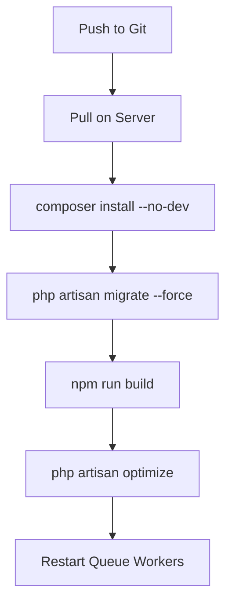

# 15.1 Deployment Preparation (การเตรียมตัว Deploy)

> **บทนี้คุณจะได้เรียนรู้**
> - การเตรียม Environment สำหรับ Production
> - การตั้งค่า .env สำหรับ Production
> - Server Requirements
> - Deployment Checklist

---

## วัตถุประสงค์การเรียนรู้

เมื่อจบบทเรียนนี้ ผู้เรียนจะสามารถ:
1. เตรียม Environment สำหรับ Production ได้
2. ตั้งค่า .env ที่ปลอดภัยสำหรับ Production ได้
3. ตรวจสอบ Server Requirements ได้

---

## เนื้อหา

### 1. Server Requirements

| ซอฟต์แวร์ | เวอร์ชันขั้นต่ำ |
|----------|--------------|
| PHP | 8.2+ |
| MySQL/MariaDB | 8.0+ / 10.3+ |
| Composer | 2.x |
| Node.js | 18+ (สำหรับ Build Assets) |
| Nginx/Apache | Latest |

### 2. ตั้งค่า .env สำหรับ Production

```bash
APP_NAME="MyApp"
APP_ENV=production
APP_KEY=base64:xxxxx
APP_DEBUG=false
APP_URL=https://myapp.com

DB_CONNECTION=mysql
DB_HOST=127.0.0.1
DB_DATABASE=myapp_prod
DB_USERNAME=myapp_user
DB_PASSWORD=strong_password

CACHE_DRIVER=redis
SESSION_DRIVER=redis
QUEUE_CONNECTION=redis

MAIL_MAILER=smtp
MAIL_HOST=smtp.mailgun.org
```

### 3. Deployment Steps



### 4. Deployment Checklist

| รายการ | คำสั่ง/การตั้งค่า |
|--------|-----------------|
| ปิด Debug | `APP_DEBUG=false` |
| ตั้ง Production | `APP_ENV=production` |
| Install Dependencies | `composer install --optimize-autoloader --no-dev` |
| Run Migrations | `php artisan migrate --force` |
| Build Assets | `npm run build` |
| Cache Config | `php artisan optimize` |
| Set Permissions | `chmod -R 775 storage bootstrap/cache` |
| Create Storage Link | `php artisan storage:link` |
| Generate Key | `php artisan key:generate` (ครั้งแรกเท่านั้น) |

---

## สรุป

| หัวข้อ | สิ่งที่ได้เรียนรู้ |
|--------|-------------------|
| .env | ตั้งค่า Production: debug=false, env=production |
| Dependencies | `--no-dev --optimize-autoloader` |
| Optimize | `php artisan optimize` Cache ทุกอย่าง |
| Permissions | storage และ bootstrap/cache ต้อง writable |

---

**Navigation:**
[⬅️ ก่อนหน้า](../14-performance/03-code-optimization.md) | [📚 สารบัญ](../../README.md) | [➡️ ถัดไป](02-version-control.md)
