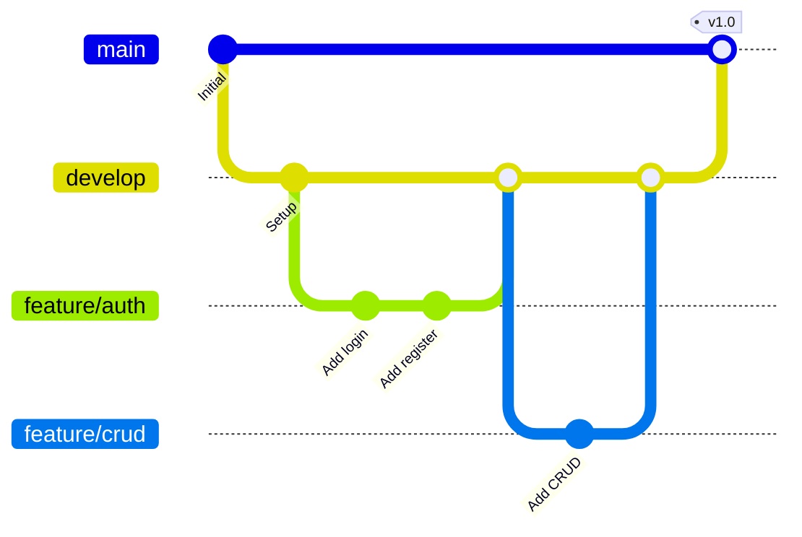

# 15.2 Version Control (การจัดการเวอร์ชัน)

> **บทนี้คุณจะได้เรียนรู้**
> - Git พื้นฐานสำหรับ Laravel
> - .gitignore ที่สำคัญ
> - Branching Strategy
> - การทำงานเป็นทีมด้วย Git

---

## วัตถุประสงค์การเรียนรู้

เมื่อจบบทเรียนนี้ ผู้เรียนจะสามารถ:
1. ใช้ Git จัดการโค้ด Laravel ได้
2. ตั้งค่า .gitignore ที่เหมาะสมได้
3. ใช้ Branching Strategy ทำงานเป็นทีมได้

---

## เนื้อหา

### 1. Git พื้นฐาน

```bash
# เริ่มต้น
git init
git add .
git commit -m "Initial commit"
git remote add origin https://github.com/user/repo.git
git push -u origin main

# การทำงานประจำวัน
git pull origin main          # ดึงโค้ดล่าสุด
git checkout -b feature/name  # สร้าง Branch ใหม่
git add .
git commit -m "Add feature"
git push origin feature/name
```

### 2. .gitignore สำหรับ Laravel

```gitignore
/node_modules
/public/build
/public/hot
/public/storage
/storage/*.key
/vendor
.env
.env.backup
.env.production
.phpunit.result.cache
Homestead.json
Homestead.yaml
npm-debug.log
yarn-error.log
```

| ไฟล์/โฟลเดอร์ | เหตุผลที่ไม่ Commit |
|---------------|-------------------|
| `.env` | มี Credentials |
| `vendor/` | ติดตั้งจาก composer.lock |
| `node_modules/` | ติดตั้งจาก package.json |
| `storage/` | ไฟล์ที่ Generate |

### 3. Branching Strategy



| Branch | หน้าที่ |
|--------|--------|
| `main` | โค้ดที่ Deploy แล้ว |
| `develop` | โค้ดที่พัฒนาเสร็จ |
| `feature/*` | ฟีเจอร์ใหม่ |
| `hotfix/*` | แก้ Bug เร่งด่วน |

---

## สรุป

| หัวข้อ | สิ่งที่ได้เรียนรู้ |
|--------|-------------------|
| Git | จัดการเวอร์ชันโค้ด |
| .gitignore | ไม่ Commit .env, vendor, node_modules |
| Branching | main → develop → feature/* |
| Pull Request | Review โค้ดก่อน Merge |

---

**Navigation:**
[⬅️ ก่อนหน้า](01-deployment-prep.md) | [📚 สารบัญ](../../README.md) | [➡️ ถัดไป](03-best-practices.md)
