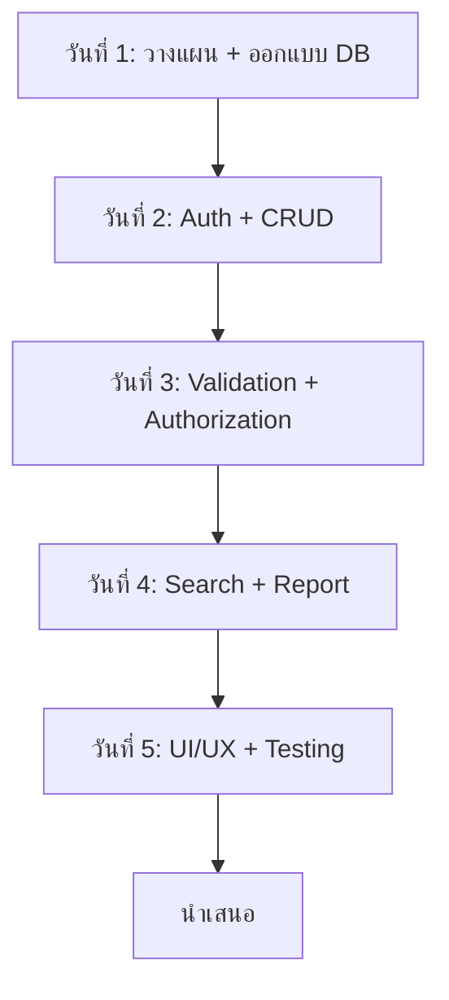

# 16.1 Project Assignment (โจทย์โปรเจกต์)

> **บทนี้คุณจะได้เรียนรู้**
> - โจทย์โปรเจกต์สำหรับฝึกปฏิบัติ
> - ขอบเขตและฟีเจอร์ที่ต้องทำ
> - เกณฑ์การให้คะแนน
> - Timeline การส่งงาน

---

## วัตถุประสงค์การเรียนรู้

เมื่อจบบทเรียนนี้ ผู้เรียนจะสามารถ:
1. เข้าใจโจทย์โปรเจกต์และขอบเขตงาน
2. วางแผนการพัฒนาโปรเจกต์ได้
3. ประยุกต์ใช้ความรู้ทั้งหมดที่เรียนมาได้

---

## เนื้อหา

### 1. โจทย์โปรเจกต์: ระบบจัดการข้อมูลองค์กร

สร้างเว็บแอปพลิเคชันด้วย Laravel สำหรับจัดการข้อมูลภายในองค์กร

### 2. ฟีเจอร์ที่ต้องทำ

| ฟีเจอร์ | รายละเอียด | คะแนน |
|---------|-----------|-------|
| **Authentication** | Login, Register, Logout | 10 |
| **CRUD หลัก** | สร้าง, อ่าน, แก้ไข, ลบข้อมูล | 20 |
| **Validation** | ตรวจสอบข้อมูลทุก Form | 10 |
| **Authorization** | แบ่ง Role (Admin/User) | 10 |
| **Search & Filter** | ค้นหาและกรองข้อมูล | 10 |
| **Pagination** | แบ่งหน้าข้อมูล | 5 |
| **File Upload** | อัปโหลดรูปภาพ/ไฟล์ | 10 |
| **Report** | รายงานสรุป + Export | 10 |
| **UI/UX** | หน้าตาสวยงาม ใช้งานง่าย | 10 |
| **Security** | CSRF, XSS, SQL Injection | 5 |
| **รวม** | | **100** |

### 3. ขั้นตอนการพัฒนา

### 4. ตัวอย่างโปรเจกต์

| โปรเจกต์ | รายละเอียด |
|---------|-----------|
| ระบบจัดการนักศึกษา | CRUD นักศึกษา, รายวิชา, ผลการเรียน |
| ระบบจัดการสินค้า | CRUD สินค้า, หมวดหมู่, ออเดอร์ |
| ระบบจัดการบุคลากร | CRUD พนักงาน, แผนก, การลา |
| ระบบจัดการห้องสมุด | CRUD หนังสือ, สมาชิก, การยืม-คืน |

---

## สรุป

| หัวข้อ | สิ่งที่ได้เรียนรู้ |
|--------|-------------------|
| โจทย์ | ระบบจัดการข้อมูลองค์กร |
| ฟีเจอร์หลัก | Auth, CRUD, Validation, Authorization |
| คะแนน | 100 คะแนน |
| Timeline | 5 วัน |

---

**Navigation:**
[⬅️ ก่อนหน้า](../15-deployment/03-best-practices.md) | [📚 สารบัญ](../../README.md) | [➡️ ถัดไป](02-ai-prompting.md)
