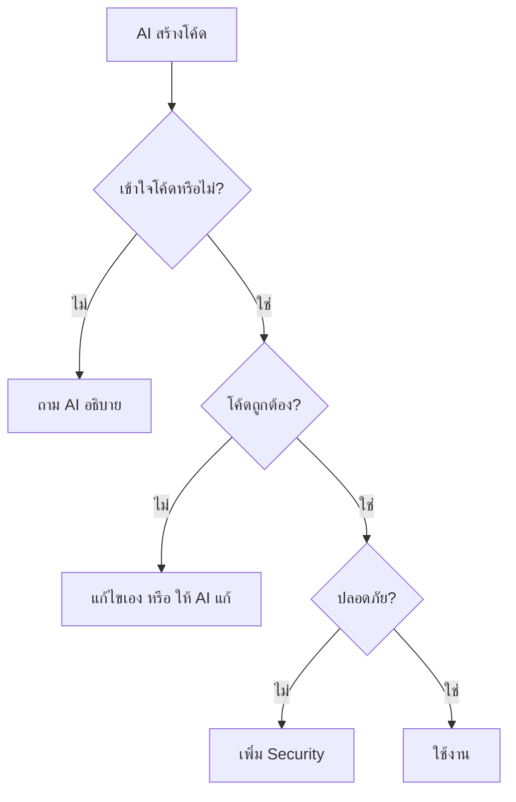

# 16.2 AI Prompting (การใช้ AI ช่วยพัฒนา)

> **บทนี้คุณจะได้เรียนรู้**
> - หลักการเขียน Prompt ที่ดี
> - Prompt สำหรับ Laravel Development
> - การ Review โค้ดจาก AI
> - ข้อควรระวังในการใช้ AI

---

## วัตถุประสงค์การเรียนรู้

เมื่อจบบทเรียนนี้ ผู้เรียนจะสามารถ:
1. เขียน Prompt ที่ได้ผลลัพธ์ตรงตามต้องการได้
2. ใช้ AI ช่วยเขียนโค้ด Laravel ได้อย่างมีประสิทธิภาพ
3. ตรวจสอบและปรับปรุงโค้ดจาก AI ได้

---

## เนื้อหา

### 1. หลักการเขียน Prompt ที่ดี

| หลักการ | ตัวอย่าง |
|---------|---------|
| **ระบุบริบท** | "ใน Laravel 11 ..." |
| **ระบุสิ่งที่ต้องการ** | "สร้าง Controller สำหรับ CRUD สินค้า" |
| **ระบุรายละเอียด** | "มี Validation, File Upload, Pagination" |
| **ระบุรูปแบบ** | "เขียนเป็น Resource Controller" |
| **ระบุข้อจำกัด** | "ใช้ Eloquent ไม่ใช้ Raw Query" |

### 2. Prompt ตัวอย่างสำหรับ Laravel

```
สร้าง Laravel Resource Controller สำหรับจัดการสินค้า (Product) ที่มี:
- CRUD ครบทั้ง 7 methods
- Validation ใน store() และ update()
- File Upload สำหรับรูปสินค้า
- Eager Loading สำหรับ Category relationship
- Pagination 10 รายการต่อหน้า
- ใช้ Route Model Binding
```

```
สร้าง Migration สำหรับตาราง products ที่มี:
- id, name (string), price (decimal 10,2)
- description (text, nullable)
- image (string, nullable)
- category_id (foreign key)
- user_id (foreign key)
- is_active (boolean, default true)
- timestamps, softDeletes
```

```
สร้าง Blade Template สำหรับหน้ารายการสินค้าที่มี:
- ตารางแสดงข้อมูล
- ช่องค้นหาและกรองตามหมวดหมู่
- Pagination
- ปุ่ม ดู, แก้ไข, ลบ
- ใช้ TailwindCSS
```

### 3. การ Review โค้ดจาก AI



### 4. ข้อควรระวัง

| ข้อควรระวัง | รายละเอียด |
|------------|-----------|
| **ตรวจสอบเสมอ** | อย่าใช้โค้ดจาก AI โดยไม่ตรวจสอบ |
| **เข้าใจก่อนใช้** | ต้องเข้าใจว่าโค้ดทำอะไร |
| **Security** | ตรวจสอบ SQL Injection, XSS |
| **Best Practices** | ตรวจว่าตรงตาม Laravel Convention |
| **Testing** | ทดสอบโค้ดก่อนใช้จริง |

---

## สรุป

| หัวข้อ | สิ่งที่ได้เรียนรู้ |
|--------|-------------------|
| Prompt | ระบุบริบท + สิ่งที่ต้องการ + รายละเอียด |
| Review | ตรวจสอบความถูกต้องและความปลอดภัย |
| ข้อควรระวัง | เข้าใจก่อนใช้, ทดสอบเสมอ |

---

**Navigation:**
[⬅️ ก่อนหน้า](01-project-assignment.md) | [📚 สารบัญ](../../README.md) | [➡️ ถัดไป](03-project-requirements.md)
